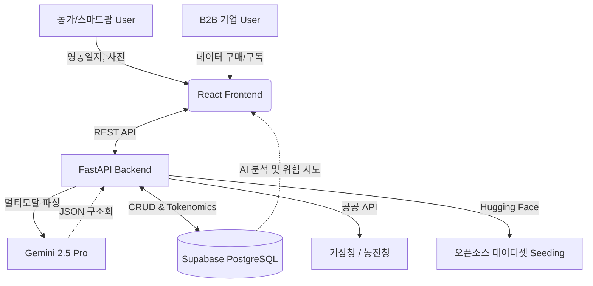

# MDGA (Universal Data Engine) 🚀

**차세대 농림/스마트팜 특화 데이터 파이프라인 및 B2B 마켓플레이스**

MDGA는 농가의 수기 일지, 생육 데이터, 외부 공공 기상 데이터를 결합하여 **고품질 합성 데이터를 생성하고 농업 AX(Agricultural AX) 인사이트를 제공하는 플랫폼**입니다. 양돈 농가를 위한 방역 및 폐사 위험 모니터링부터, 스마트팜을 위한 매출 기반 AI 재배량 추천, 그리고 B급 농산물 소상공인 직거래 매칭까지 지원합니다.

## 🌟 핵심 4대 기능 (Core Features)

1. **AI 데이터 원터치 변환기 (Data One-Touch Converter)**
   - 수기 영농일지, 백신 접종 내역, 현장 사진을 촬영/음성 입력 시 정부 표준(HACCP 등) JSON 데이터로 자동 변환 및 적재.
2. **Twin Map 기반 방역/환경 위험 모니터링 (Twin Map Risk Insight)**
   - 주변의 아프리카돼지열병(ASF), 구제역 등 전염병 발생 현황 및 폭염/환기 지수 경계를 실시간 지도로 시각화.
3. **B급 농산물 B2B 직거래 플랫폼 (B-grade Produce Market)**
   - 상품성이 낮은 '못난이 농작물'을 가공용(베이커리, 주스바 등)으로 지역 소상공인과 매칭하는 직거래 채널.
4. **AI 위기 관리 및 오픈소스 기반 합성 데이터 (Synthesis Insight)**
   - **농가용:** 축사 폭염 폐사 골든타임 알람, 생육 환경 모니터링 및 통합 매출 분석 기반 AI 재배량 추천.
   - **엔터프라이즈용:** AgiBot, EnvHub, RoboCasa 오픈소스를 활용한 비전/자율주행용 합성 데이터 생성 및 거래.

## 📚 상세 문서 (Documentation)
자세한 아키텍처 및 기획, API 명세는 `docs/` 폴더를 참조하세요.
- 👉 **[MDGA 통합 문서 인덱스 보기 (docs/README.md)](docs/README.md)**

## 🏗️ 시스템 구성 (System Architecture)
- **Frontend**: React 19, Vite, Tailwind CSS, Framer Motion (Cloudflare Pages 배포)
- **Backend**: Python 3.11, FastAPI, SQLAlchemy 2.0 (Render.com 배포)
- **Database**: PostgreSQL (Supabase)
- **AI / Data**: Gemini 2.5 Pro (멀티모달 파싱 및 분석)



## 🚀 빠른 시작 (Getting Started)

### 환경 변수 설정 (`backend/.env`)
```env
DATABASE_URL=postgresql://[user]:[password]@[host]:6543/postgres
GEMINI_API_KEY=your_gemini_api_key
```

### 로컬 서버 실행
```bash
# 통합 실행 스크립트 (백엔드 8080포트, 프론트엔드 5173포트 동시 실행)
./dev.sh
```

---
*MDGA - Empowering the Future of Agricultural Transformation.* 🌾
