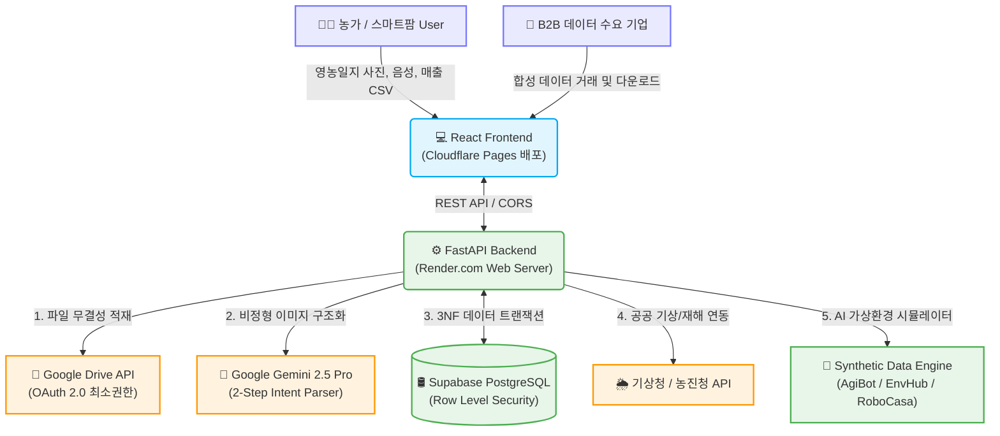

# MDGA (Universal Data Engine) 🌾🚀

<div align="center">
  
  
  <br />

  [](https://fastapi.tiangolo.com/)
  [](https://react.dev/)
  [](https://tailwindcss.com/)
  [](https://www.postgresql.org/)
  [](https://deepmind.google/technologies/gemini/)

  <h3>차세대 농림/스마트팜 특화 데이터 파이프라인 및 B2B 합성 데이터 마켓플레이스</h3>

  <p>
    MDGA는 파편화된 농가의 수기 영농일지, 생육 데이터, 외부 공공 데이터를 결합하여 <strong>고품질의 지능형 합성 데이터(Synthetic Data)를 생성하고 농업 AX(AI Transformation) 인사이트를 제공</strong>하는 엔터프라이즈급 플랫폼입니다.
  </p>
</div>

---

## 📅 프로젝트 개요 & 타임라인 (Project Timeline)

본 프로젝트는 **2026년 대구 지역전략산업 문제해결 지식재산 리빙랩** 대회를 위해 개발되었으며, 기획부터 특허성 분석, 실서비스 배포 및 고도화까지 진행되어 공식 아카이빙이 완료된 저장소입니다.

* **총 진행 기간**: **2026.03.16 ~ 2026.05.31** (공식 프로젝트 클로징)
* **주요 마일스톤**:

<details>
<summary><b>⏱️ 상세 개발 및 활동 연혁 보기 (클릭하여 확장)</b></summary>
<div markdown="1">

* 📅 **2026.03.16**: 대회 참가 신청 및 초기 사업 계획/제안서 제출 (아이디어 빌드업)
* 📅 **2026.04.29**: 중간 점검용 활동 보고서 및 1차 회의록 제출
* 📅 **2026.04.30**: 중간 평가 발표 및 1차 MVP (Data Converter, Twin Map 프로토타입) 시연
* 📅 **2026.05.17**: 변리사 연계 선행 기술 조사 및 지식재산(IP) 특허성 검토 자문 미팅
* 📅 **2026.05.18**: 최종 공식 활동 보고서 및 종합 회의록 제출
* 📅 **2026.05.19**: **최종 심사 및 본선 발표** (Hugging Face 실데이터 파이프라인, AI 실시간 감별, 지갑 연동 MVP 시연)
* 📅 **2026.05.31**: 프로젝트 최종 마무리 및 깃허브 업로드용 저장소 정리 완료

</div>
</details>

---

## 🎬 시연 영상 & 발표 자료 쇼케이스 (Showcase)

> [!IMPORTANT]  
> **[대용량 발표 파일 다운로드 안내]**  
> 용량이 큰 원본 영상(`*.mp4`), 사업계획서(`*.hwp`), 발표자료(`*.pptx`) 등은 GitHub 용량 제한(100MB) 및 로컬 클론 속도 보존을 위해 Git 커밋에서 제외하고 **GitHub Releases**에 업로드되어 있습니다.  
> 깃허브 웹 화면에서 파일이 보이지 않는 경우, 아래의 **`🌐 온라인 다운로드`** 링크를 클릭하시면 즉시 다운로드하여 감상하실 수 있습니다!  
> 자세한 업로드/다운로드 관리 방법은 👉 **[대용량 산출물 아카이빙 가이드(docs/05_Competition_Deliverables/GITHUB_RELEASE_GUIDE.md)](./docs/05_Competition_Deliverables/GITHUB_RELEASE_GUIDE.md)**를 참고해주세요.

<table width="100%">
  <tr>
    <td width="50%" align="center">
      <h4>🏆 최종 본선 발표 시연 (Final Demo Video)</h4>
      <a href="https://www.youtube.com/watch?v=KS7ftQ3nPoo&t=46s" target="_blank">
        
      </a>
      <p><i>(최종 발표 및 풀 파이프라인 시연 - 클릭 시 유튜브 이동)</i></p>
      <sub>
        🎥 <b>최종 발표 동영상 원본</b><br/>
        • 🌐 <a href="https://github.com/softkleenex/livinglab_2026/releases/download/v1.0.0-archive/MDGA_Final_Demo.mp4">온라인 다운로드 (138MB)</a><br/>
        • 💻 <a href="file:///Volumes/samsd/workspace_v2/livinglab_2026/docs/05_Competition_Deliverables/02_Final/[MDGA_리빙랩_최종] 시연영상.mp4">로컬 원본 경로</a>
      </sub>
    </td>
    <td width="50%" align="center">
      <h4>⏱️ 중간 점검 발표 시연 (Intermediate Demo Video)</h4>
      <a href="https://youtu.be/bFC9kAiN40U" target="_blank">
        
      </a>
      <p><i>(중간 평가 및 MVP 프로토타입 시연 - 클릭 시 유튜브 이동)</i></p>
      <sub>
        🎥 <b>중간 점검 동영상 원본</b><br/>
        • 🌐 <a href="https://github.com/softkleenex/livinglab_2026/releases/download/v1.0.0-archive/MDGA_Intermediate_Demo.mp4">온라인 다운로드 (30.4MB)</a><br/>
        • 💻 <a href="file:///Volumes/samsd/workspace_v2/livinglab_2026/docs/05_Competition_Deliverables/01_Intermediate/[MDGA_리빙랩_중간] 시연영상.mp4">로컬 원본 경로</a>
      </sub>
    </td>
  </tr>
</table>

<br />

<div align="center">
  <h4>📊 최종 발표 자료 및 종합 보고서 (Presentation Slides & Reports)</h4>
  <a href="https://github.com/softkleenex/livinglab_2026/releases/download/v1.0.0-archive/MDGA_Final_Slides.pdf" target="_blank">
    
  </a>
  <p><i>(위 발표 자료 이미지 카드를 클릭하시면 릴리즈에서 직접 PDF 보고서가 다운로드됩니다)</i></p>
  <sub>
    📁 <b>최종 산출물 모음</b><br/>
    • 📊 <b>최종 발표 슬라이드</b>: 🌐 <a href="https://github.com/softkleenex/livinglab_2026/releases/download/v1.0.0-archive/MDGA_Final_Slides.pptx">PPTX 다운로드 (9.0MB)</a> \| 🌐 <a href="https://github.com/softkleenex/livinglab_2026/releases/download/v1.0.0-archive/MDGA_Final_Slides.pdf">PDF 다운로드 (2.9MB)</a> \| 💻 <a href="file:///Volumes/samsd/workspace_v2/livinglab_2026/docs/05_Competition_Deliverables/02_Final/[MDGA_리빙랩_최종] 발표자료.pptx">로컬 PPTX 경로</a><br/>
    • 📄 <b>최종 활동보고서 및 회의록</b>: 🌐 <a href="https://github.com/softkleenex/livinglab_2026/releases/download/v1.0.0-archive/MDGA_Final_Report.pdf">PDF 다운로드 (52.2MB)</a> \| 💻 <a href="file:///Volumes/samsd/workspace_v2/livinglab_2026/docs/05_Competition_Deliverables/02_Final/[MDGA_리빙랩_최종] 활동보고서_및_회의록.pdf">로컬 PDF 경로</a><br/>
    • 📄 <b>중간 활동보고서 및 회의록</b>: 🌐 <a href="https://github.com/softkleenex/livinglab_2026/releases/download/v1.0.0-archive/MDGA_Intermediate_Report.pdf">PDF 다운로드 (90.3MB)</a> \| 💻 <a href="file:///Volumes/samsd/workspace_v2/livinglab_2026/docs/05_Competition_Deliverables/01_Intermediate/[MDGA_리빙랩_중간] 활동보고서_및_회의록.pdf">로컬 PDF 경로</a>
  </sub>
</div>

---

## 🌟 핵심 4대 기능 상세 명세 (Core Features)

<table width="100%">
  <tr>
    <td width="50%" valign="top">
      <h3>1. AI 데이터 원터치 변환기 ✍️</h3>
      <ul>
        <li><b>정밀 AI 파싱</b>: Google Gemini 2.5 Pro Multimodal 비전 능력을 활용하여 수기 일지, 약품 처방전, 칠판 메모 등의 비정형 사진/음성을 식별.</li>
        <li><b>HACCP 표준 정형화</b>: 파싱된 원천 데이터를 축산물이력제 및 정부 방역 표준 규격에 부합하는 정형 JSON 데이터로 1초 만에 자동 구조화.</li>
        <li><b>2-Step 추출 아키텍처</b>: 대화형 안전 필터링을 우회하고 정밀한 트랜잭션을 실행하기 위해 Intent Parser와 Metadata Extractor 레이어를 독립 설계.</li>
      </ul>
    </td>
    <td width="50%" valign="top">
      <h3>2. Twin Map 기반 방역 위험 모니터링 🗺️</h3>
      <ul>
        <li><b>디지털 트윈 매핑</b>: Leaflet.js 라이브러리를 동적으로 활용하여 농장 경계 및 가축 행동 반경을 시각 지도로 추적.</li>
        <li><b>공간 계층 롤업(Roll-up)</b>: 개별 Farm 데이터를 구(District) -> 시(City) -> 도(Province) 단위로 실시간 집계하는 롤업 비동기 엔진 구현.</li>
        <li><b>공공 질병 데이터 연동</b>: 아프리카돼지열병(ASF), 구제역 등 실시간 전염병 공공 API와 위치 메타데이터를 결합한 능동형 방역 서클 형성.</li>
      </ul>
    </td>
  </tr>
  <tr>
    <td width="50%" valign="top">
      <h3>3. B급 못난이 농산물 B2B 직거래 플랫폼 🍎</h3>
      <ul>
        <li><b>실시간 비전 품질 판별</b>: 가공용 못난이 농산물 사진 업로드 시 당도 예측 및 등급(A/B/C)을 AI가 자동 판별하여 매칭 적합도 도출.</li>
        <li><b>소상공인 다이렉트 매칭</b>: 상품성이 다소 결여된 농작물을 가공용 원료로 활용하는 지역 베이커리, 주스숍 등 소상공인과 실시간 딜 매칭.</li>
        <li><b>토크노믹스 및 지갑 연동</b>: Mockup 연동을 100% 제거하고, 지갑(Wallet)의 실제 토큰 잔액 증감, 트랜잭션 기록 및 CSV 원장 수출(Export) 완벽 구현.</li>
      </ul>
    </td>
    <td width="50%" valign="top">
      <h3>4. AI 위기 관리 및 B2B 합성 데이터 엔진 🤖</h3>
      <ul>
        <li><b>기후 스트레스 시뮬레이션</b>: 열스트레스지수(THI) 수학적 공식을 활용하여 폭염 가축 폐사 위험을 감지, 골든타임 2시간 전에 강력 알림 송출.</li>
        <li><b>오픈소스 가상환경 인터페이스</b>: 정형화된 실농가 환경 데이터를 자율주행 농기계 학습을 위한 <b>AgiBot</b>, 기후 시뮬레이터 <b>EnvHub</b>, 3D 가상 렌더링 <b>RoboCasa</b> 등 세계 수준의 AI 가상 물리 엔진에 주입 가능한 포맷으로 변환.</li>
        <li><b>B2B 데이터 마켓플레이스</b>: 합성 데이터(Synthetic Data)를 수요 기업(AI 연구소, 자율주행 엔지니어링사)에 라이선스 형태로 판매하고 API Key를 발급하는 과금 솔루션 내장.</li>
      </ul>
    </td>
  </tr>
</table>

---

## 🛠️ 주요 기술적 작업 및 핵심 개발 성과 (Technical Accomplishments)

리빙랩 경진대회를 완벽한 완성도로 치르기 위해 프로토타입 상태였던 프로젝트를 **엔터프라이즈급 Production-Ready MVP**로 완전히 진화시켰습니다.

### 🛢️ 1. 데이터 무결성을 보장하는 3정규화(3NF) RDBMS 완전 마이그레이션
* **기존 한계**: 메모리 상의 트리 구조로 상태를 관리하여 Scale-out이 불가능했으며 데이터 유실 및 무결성 파괴 리스크에 노출.
* **기술적 해결**: 관계형 데이터베이스인 Supabase Postgres로 데이터 저장 메커니즘을 전면 전향. `Region`, `Farm`, `DataEntry`, `Wallet`, `SyntheticData` 테이블 구조를 3정규화(3NF)로 정밀하게 분할하고, 외래키(FK) 및 `ON DELETE CASCADE` 등 데이터 제약 조건을 엄격히 구축하여 영구적이고 완전한 데이터 무결성 보장.

### 🧠 2. LLM Safety Alignment 우회 및 시스템 제어 의도 파싱 이중화
* **기존 한계**: 사용자가 영농일지 챗봇을 통해 "방금 올린 이상 데이터 삭제해줘"라고 명령 시, AI 자체의 안전망(Safety Alignment)에 걸려 시스템 트랜잭션 제어를 거부하는 교착 상태 발생.
* **기술적 해결**: AI 모델 아키텍처를 대화형 페르소나와 **의도 분석기(Intent Parser)** 2개 레이어로 이중 분리. 의도 분석기는 순수 감정 없는 순수 JSON 스키마만을 출력하도록 강력 구속하고, 백엔드가 해당 JSON 구조(`action: DELETE`)를 안전하게 수신해 실제 DB 트랜잭션을 실행하는 AI 제어 보안 설계 완성.

### 🔑 3. Google Drive API 격리된 보안 권한 연동
* **기존 한계**: 파일 저장소(Data Lake)인 Google Drive 연동 시, 전역 드라이브 권한 요구로 인한 보안 감사 취약 및 403 Forbidden 권한 거부 에러 수시 발생.
* **기술적 해결**: 최소 권한 원칙(Principle of Least Privilege)을 적용하여 `auth/drive.file` 수준으로 권한을 타이트하게 격리. DB 상에 기록되는 영농 파일의 고유 해시(`hash_val`)와 Google Drive 고유 File ID를 정밀하게 매핑하여, 어플리케이션이 스스로 생성한 객체만 정밀하게 외과 수술식으로 제어하도록 구조화.

### 🌐 4. Mockup 전면 제거 및 Hugging Face 실데이터 파이프라인(Seeding) 구축
* **기존 한계**: 초기 데모 버전은 임의의 가짜 랜덤(Random) 시드 데이터에 의존하여 대시보드 그래프 신뢰성이 낮았음.
* **기술적 해결**: 데이터 시각화의 리얼리티 확보를 위해 **Hugging Face (`jason1966/aksahaha_crop-recommendation`)** 오픈 데이터셋을 연동하는 파이프라인 제작. 실제 작물 생육 환경에 근접한 수백만 개 단위의 글로벌 정밀 영농 실측 환경 정보 데이터를 당겨와 데이터베이스 초기 상태(Initial State)로 시딩함으로써 시뮬레이션 및 데이터 가치 평가의 신뢰도를 실제 서비스 모델급으로 상승.

---

## 🏗️ 시스템 아키텍처 (System Architecture)

MDGA는 로컬뿐만 아니라 **실제 배포 완료된 서버 환경(FastAPI ➔ Render.com / React ➔ Cloudflare Pages / DB ➔ Supabase)**에서 실시간으로 Google Drive API와 Gemini API를 통합 운용하고 있습니다.



---

## 🛠️ 기술 스택 (Technology Stack)

| 구분 | 오픈소스 및 핵심 기술 | 설명 |
| :--- | :--- | :--- |
| **Frontend** | React 19, Vite, Tailwind CSS, Framer Motion, Leaflet.js | 고성능 대시보드, 현대적인 디자인 시스템 및 공간 시각화 지도 구현 |
| **Backend** | Python 3.11, FastAPI, SQLAlchemy 2.0, Uvicorn | 완전 비동기 REST API 서버, 3정규화(3NF) RDBMS 트랜잭션 보장 |
| **Database** | PostgreSQL (Supabase) | FK 제약조건, `ON DELETE CASCADE` 연동 및 RLS(Row Level Security) 보안 |
| **AI / Data** | Google Gemini 2.5 Pro Vision, Hugging Face, Pandas | 멀티모달 프롬프트 엔지니어링, 실데이터 Seeding 파이프라인 |
| **DevOps** | Render (Backend), Cloudflare Pages (Frontend), GitHub Actions | 무중단 서비스 배포 운영 환경 확보 및 자동 CI/CD 라인 구축 |

---

## 📚 상세 문서 디렉토리 구조 (Documentation)

문서 전체 목차는 👉 **[MDGA 통합 문서 인덱스 보기 (docs/README.md)](./docs/README.md)** 페이지에서 완벽하게 통합 관리되고 있습니다.

```text
docs/
├── README.md                   # 전체 문서 통합 인덱스 (포털)
├── 00_Overview/                # 프로젝트 상세 기획 및 포트폴리오 면접 가이드
├── 01_Requirements_&_Design/   # 페르소나 기획, 경쟁사 BM 분석, 비즈니스 룰, 유저 플로우
├── 02_Architecture_&_API/      # 시스템 아키텍처 설계도, DB ERD, REST/외부 API 명세서
├── 03_Infrastructure/          # 실 서버 배포 상태 분석, 배포 가이드, 보안 정책 및 향후 확장 로드맵
├── 04_Research_&_Feedback/     # 돈사/스마트팜 농가 상세 인터뷰, 변리사 특허성 자문 회의록
└── 05_Competition_Deliverables/ # 🏆 대회 신청 제안서, 중간/최종 발표 보고서, 시연 영상, 카드뉴스
```

---

## 🚀 로컬 개발 가이드 (Getting Started)

### 1. 환경 변수 설정 (`backend/.env`)
```env
DATABASE_URL=postgresql://[user]:[password]@[host]:6543/postgres
GEMINI_API_KEY=your_gemini_api_key_here
```

### 2. 로컬 실행
프로젝트 루트 폴더에서 통합 개발 환경 실행 스크립트를 작동시킵니다:
```bash
# 통합 백엔드(8080) 및 프론트엔드(5173) 동시 실행 스크립트
./dev.sh
```

---
*MDGA - Empowering the Future of Agricultural Transformation.* 🌾
