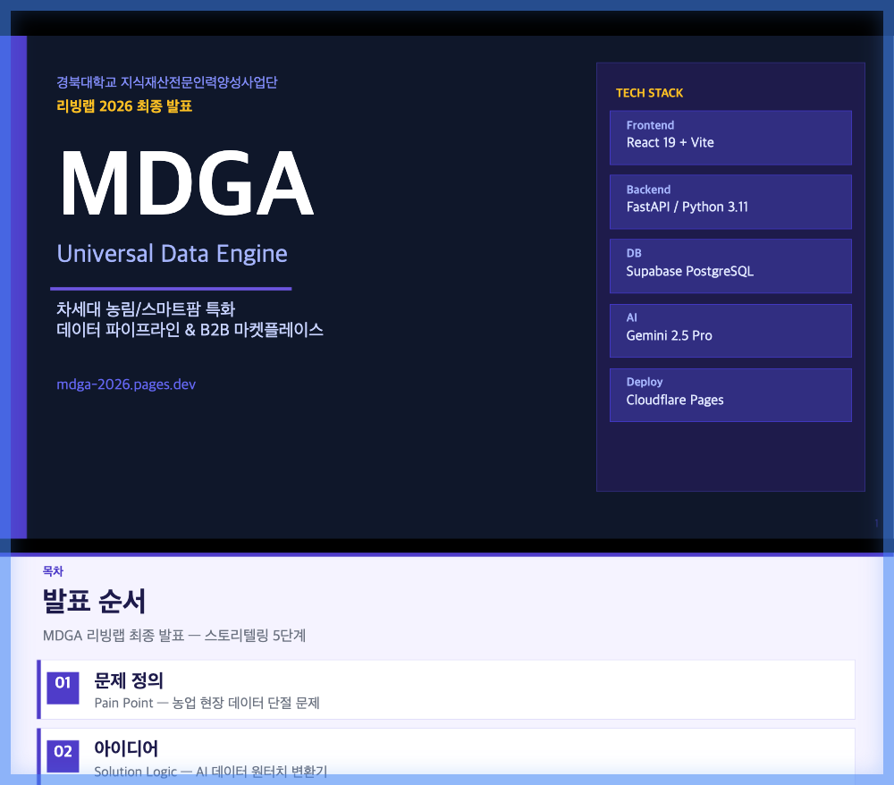
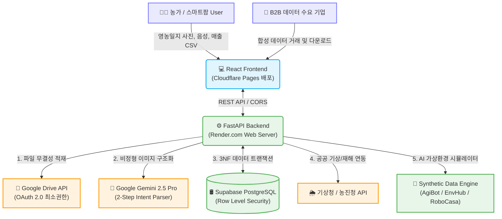

# MDGA (Universal Data Engine) 🌾🚀

<div align="center">
  
  
  <br />

  [](https://fastapi.tiangolo.com/)
  [](https://react.dev/)
  [](https://tailwindcss.com/)
  [](https://www.postgresql.org/)
  [](https://deepmind.google/technologies/gemini/)

  <h3>차세대 농림/스마트팜 특화 데이터 파이프라인 및 B2B 합성 데이터 마켓플레이스</h3>

  <p>
    MDGA는 파편화된 농가의 수기 영농일지, 생육 데이터, 외부 공공 데이터를 결합하여 <strong>고품질의 지능형 합성 데이터(Synthetic Data)를 생성하고 농업 AX(AI Transformation) 인사이트를 제공</strong>하는 엔터프라이즈급 플랫폼입니다.
  </p>
</div>

---

## 📅 프로젝트 개요 & 타임라인 (Project Timeline)

본 프로젝트는 **2026년 대구 지역전략산업 문제해결 지식재산 리빙랩** 대회를 위해 개발되었으며, 기획부터 특허성 분석, 실서비스 배포 및 고도화까지 진행되어 공식 아카이빙이 완료된 저장소입니다.

* **총 진행 기간**: **2026.03.16 ~ 2026.05.31** (공식 프로젝트 클로징)
* **주요 마일스톤**:

<details>
<summary><b>⏱️ 상세 개발 및 활동 연혁 보기 (클릭하여 확장)</b></summary>
<div markdown="1">

* 📅 **2026.03.16**: 대회 참가 신청 및 초기 사업 계획/제안서 제출 (아이디어 빌드업)
* 📅 **2026.04.29**: 중간 점검용 활동 보고서 및 1차 회의록 제출
* 📅 **2026.04.30**: 중간 평가 발표 및 1차 MVP (Data Converter, Twin Map 프로토타입) 시연
* 📅 **2026.05.17**: 변리사 연계 선행 기술 조사 및 지식재산(IP) 특허성 검토 자문 미팅
* 📅 **2026.05.18**: 최종 공식 활동 보고서 및 종합 회의록 제출
* 📅 **2026.05.19**: **최종 심사 및 본선 발표** (Hugging Face 실데이터 파이프라인, AI 실시간 감별, 지갑 연동 MVP 시연)
* 📅 **2026.05.31**: 프로젝트 최종 마무리 및 깃허브 업로드용 저장소 정리 완료

</div>
</details>

---

## 🎬 시연 영상 & 발표 자료 쇼케이스 (Showcase)

> [!TIP]
> 깃허브 리드미에서 시연 영상과 발표 슬라이드를 시각적으로 가장 효과적으로 보여주기 위해 **인터랙티브 모형(Mockup) 디자인**을 적용했습니다. 아래의 이미지 카드를 클릭하시면 관련 링크나 로컬 파일로 바로 연결됩니다!

<table width="100%">
  <tr>
    <td width="50%" align="center">
      <h4>🎬 최종 시연 동영상 (Demo Video)</h4>
      <a href="https://www.youtube.com/watch?v=your_video_id_here" target="_blank">
        
      </a>
      <p><i>(위 모의 플레이어 이미지를 클릭하면 시연 유튜브 링크로 연결됩니다)</i></p>
      <sub>※ 로컬 워크스페이스 원본 경로: <a href="file:///Volumes/samsd/workspace_v2/livinglab_2026/docs/05_Competition_Deliverables/02_Final/[MDGA_리빙랩_최종] 시연영상.mp4">docs/05_Competition_Deliverables/02_Final/[MDGA_리빙랩_최종] 시연영상.mp4</a></sub>
    </td>
    <td width="50%" align="center">
      <h4>📊 최종 발표 자료 (Presentation Slides)</h4>
      <a href="./docs/05_Competition_Deliverables/02_Final/[MDGA_리빙랩_최종] 발표보고서.pdf" target="_blank">
        
      </a>
      <p><i>(위 슬라이드 이미지를 클릭하면 깃허브에서 직접 PDF 자료가 렌더링됩니다)</i></p>
      <sub>※ 파워포인트 원본 경로: <a href="file:///Volumes/samsd/workspace_v2/livinglab_2026/docs/05_Competition_Deliverables/02_Final/[MDGA_리빙랩_최종] 발표자료.pptx">docs/05_Competition_Deliverables/02_Final/[MDGA_리빙랩_최종] 발표자료.pptx</a></sub>
    </td>
  </tr>
</table>

---

## 🌟 핵심 4대 기능 (Core Features)

<table width="100%">
  <tr>
    <td width="50%" valign="top">
      <h3>1. AI 데이터 원터치 변환기 ✍️</h3>
      <p>수기 영농일지, 백신 접종 내역, 현장 사진을 스마트폰으로 촬영하거나 음성 입력 시, Google Gemini 2.5 Pro Multimodal AI가 이를 실시간 분석하여 정부 표준 규격(HACCP 등)에 맞춘 정형 JSON 데이터로 1초 만에 자동 구조화합니다.</p>
    </td>
    <td width="50%" valign="top">
      <h3>2. Twin Map 방역/환경 모니터링 🗺️</h3>
      <p>개별 농가의 위치 기반 데이터를 Region 단위로 공간 계층 롤업(Roll-up)하여 지도(Leaflet.js) 상에 실시간 아프리카돼지열병(ASF), 구제역 등 전염병 발생 위험과 온도/환기 지수를 디지털 트윈화하여 시각화합니다.</p>
    </td>
  </tr>
  <tr>
    <td width="50%" valign="top">
      <h3>3. 못난이 농산물 B2B 직거래 🍎</h3>
      <p>상품성이 떨어지는 B급 농산물 사진을 올리면 비전 AI가 당도와 등급(A/B/C)을 실시간 감별하고 지역 베이커리, 주스바 등 소상공인과 즉시 매칭합니다. 거래 대금은 자체 지갑 토크노믹스 모델과 실시간 연계됩니다.</p>
    </td>
    <td width="50%" valign="top">
      <h3>4. 지능형 B2B 합성 데이터 엔진 🤖</h3>
      <p>축적된 농가 실데이터를 바탕으로 기후 변화 시나리오 시뮬레이션을 작동시켜, 세계 최고 수준의 AI 가상 물리 엔진인 AgiBot, EnvHub, RoboCasa 등에 주입할 수 있는 B2B 고부가가치 합성 데이터(Synthetic Data)를 생성 및 판매합니다.</p>
    </td>
  </tr>
</table>

---

## 🏗️ 시스템 아키텍처 (System Architecture)

MDGA는 로컬뿐만 아니라 **실제 배포 완료된 서버 환경(FastAPI ➔ Render.com / React ➔ Cloudflare Pages / DB ➔ Supabase)**에서 실시간으로 Google Drive API와 Gemini API를 통합 운용하고 있습니다.



---

## 🛠️ 기술 스택 (Technology Stack)

| 구분 | 오픈소스 및 핵심 기술 | 설명 |
| :--- | :--- | :--- |
| **Frontend** | React 19, Vite, Tailwind CSS, Framer Motion, Leaflet.js | 고성능 대시보드, 현대적인 디자인 시스템 및 공간 시각화 지도 구현 |
| **Backend** | Python 3.11, FastAPI, SQLAlchemy 2.0, Uvicorn | 완전 비동기 REST API 서버, 3정규화(3NF) RDBMS 트랜잭션 보장 |
| **Database** | PostgreSQL (Supabase) | FK 제약조건, `ON DELETE CASCADE` 연동 및 RLS(Row Level Security) 보안 |
| **AI / Data** | Google Gemini 2.5 Pro Vision, Hugging Face, Pandas | 멀티모달 프롬프트 엔지니어링, 실데이터 Seeding 파이프라인 |
| **DevOps** | Render (Backend), Cloudflare Pages (Frontend), GitHub Actions | 무중단 서비스 배포 운영 환경 확보 및 자동 CI/CD 라인 구축 |

---

## 📚 상세 문서 디렉토리 구조 (Documentation)

문서 전체 목차는 👉 **[MDGA 통합 문서 인덱스 보기 (docs/README.md)](./docs/README.md)** 페이지에서 완벽하게 통합 관리되고 있습니다.

```text
docs/
├── README.md                   # 전체 문서 통합 인덱스 (포털)
├── 00_Overview/                # 프로젝트 상세 기획 및 포트폴리오 면접 가이드
├── 01_Requirements_&_Design/   # 페르소나 기획, 경쟁사 BM 분석, 비즈니스 룰, 유저 플로우
├── 02_Architecture_&_API/      # 시스템 아키텍처 설계도, DB ERD, REST/외부 API 명세서
├── 03_Infrastructure/          # 실 서버 배포 상태 분석, 배포 가이드, 보안 정책 및 향후 확장 로드맵
├── 04_Research_&_Feedback/     # 돈사/스마트팜 농가 상세 인터뷰, 변리사 특허성 자문 회의록
└── 05_Competition_Deliverables/ # 🏆 대회 신청 제안서, 중간/최종 발표 보고서, 시연 영상, 카드뉴스
```

---

## 🚀 로컬 개발 가이드 (Getting Started)

### 1. 환경 변수 설정 (`backend/.env`)
```env
DATABASE_URL=postgresql://[user]:[password]@[host]:6543/postgres
GEMINI_API_KEY=your_gemini_api_key_here
```

### 2. 로컬 실행
프로젝트 루트 폴더에서 통합 개발 환경 실행 스크립트를 작동시킵니다:
```bash
# 통합 백엔드(8080) 및 프론트엔드(5173) 동시 실행 스크립트
./dev.sh
```

---
*MDGA - Empowering the Future of Agricultural Transformation.* 🌾
