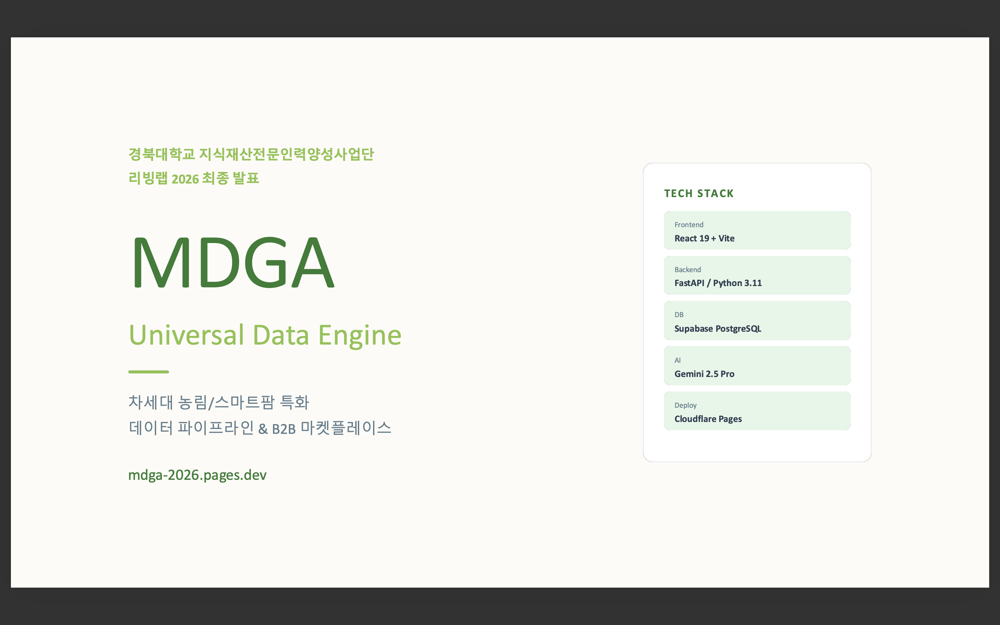
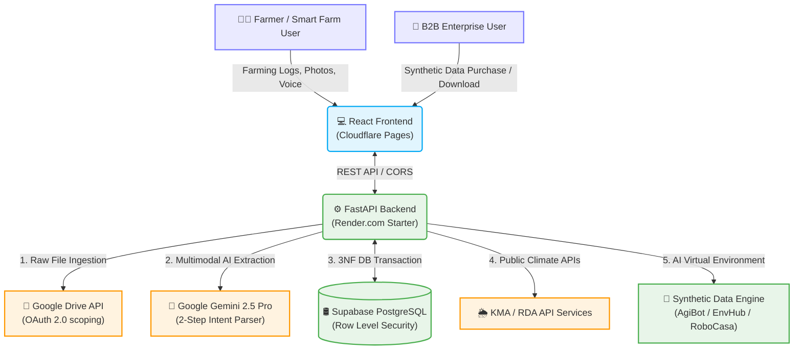

# MDGA (Universal Data Engine) 🌾🚀

<div align="center">
  
  
  <br />

  [](https://fastapi.tiangolo.com/)
  [](https://react.dev/)
  [](https://tailwindcss.com/)
  [](https://www.postgresql.org/)
  [](https://deepmind.google/technologies/gemini/)

  <h3>Next-Generation Agricultural/Smart Farm Specialized Data Pipeline & B2B Synthetic Data Marketplace</h3>

  <p>
    MDGA is an enterprise-grade platform that combines fragmented manual farming logs, crop growth data, and external public data to <strong>generate high-quality intelligent synthetic data (Synthetic Data) and provide Agricultural AX (AI Transformation) insights</strong>.
  </p>
</div>

---

## 📅 Project Timeline & Milestones

This project was developed for the **2026 Daegu Regional Strategic Industry Problem Solving Intellectual Property Living Lab** competition. The project has been successfully completed, evaluated, and fully archived.

* **Total Project Period**: **March 16, 2026 ~ May 31, 2026** (Official repository closing)
* **Key Milestones**:

<details>
<summary><b>⏱️ View Detailed Development & Activity Milestones (Click to expand)</b></summary>
<div markdown="1">

* 📅 **2026.03.16**: Registration submitted with initial business plan & project proposal (Idea Build-up)
* 📅 **2026.04.29**: Submitted intermediate activity report & 1st meeting minutes
* 📅 **2026.04.30**: Intermediate evaluation presentation & 1st MVP demo (Data Converter, Twin Map prototypes)
* 📅 **2026.05.17**: Intellectual Property (IP) consultation meeting with patent attorney for patentability review
* 📅 **2026.05.18**: Submitted final activity report & comprehensive meeting minutes
* 📅 **2026.05.19**: **Final Evaluation & Main Pitch Presentation** (Full integration demo with Hugging Face real-world datasets, real-time AI crop grading, and wallet integration MVP)
* 📅 **2026.05.31**: Final project closing and repository organization completed for GitHub upload

</div>
</details>

---

## 🏆 Achievements & Credentials

This project successfully completed all official stages of the Daegu Regional Strategic Industry Intellectual Property Living Lab 2026 and was awarded the following credentials and honors upon final evaluation.

*   **🎓 Official Completion (Daegu Intellectual Property Living Lab)**:
    *   Successfully completed all required program modules including conceptual architecture design, MVP production deployment, professional patent consulting (prior-art search), and final stage pitch presentation, earning an official completion certificate issued by the Daegu Intellectual Property Center and the Korea Invention Promotion Association.
*   **🏅 Excellent Project Award & Technical Prize**:
    *   Recognized for the high novelty and technical competitiveness of our core systems—the "AI 2-Step Decoupled Farming Log Parser" and "Ugly Crop B2B Tokenomics Wallet Ledger"—earning **final selection as an Excellent Project with a Technical Prize (equivalent to 200,000 KRW in value)**.

---

## 🎬 Demo Video & Presentation Slides Showcase

> [!IMPORTANT]  
> **[Large Deliverables Download Notice]**  
> Large-scale original videos (`*.mp4`), proposals (`*.hwp`), and presentation slides (`*.pptx`) are ignored in Git commits via `.gitignore` to prevent **Git Bloat (excessive repo size)** and guarantee instant local checkout.  
> If those files are not showing on GitHub web UI, simply click the **`🌐 Online Download`** links below to download them directly!  
> For step-by-step instructions on publishing/managing these files, please refer to the 👉 **[Large Deliverables Archiving Guide (docs/05_Competition_Deliverables/GITHUB_RELEASE_GUIDE.md)](./docs/05_Competition_Deliverables/GITHUB_RELEASE_GUIDE.md)**.

<table width="100%">
  <tr>
    <td width="50%" align="center">
      <h4>🏆 Final Pitch Presentation Demo (Final Demo Video)</h4>
      <a href="https://www.youtube.com/watch?v=KS7ftQ3nPoo&t=46s" target="_blank">
        
      </a>
      <p><i>(Final pitch & full-pipeline demonstration - Click to play on YouTube)</i></p>
      <sub>
        🎥 <b>Final Demo Video</b><br/>
        • 🌐 <a href="https://github.com/softkleenex/livinglab_2026/releases/download/v1.0.0-archive/MDGA_Final_Demo.mp4">Online Download (138MB)</a>
      </sub>
    </td>
    <td width="50%" align="center">
      <h4>⏱️ Intermediate Milestone Demo (Intermediate Demo Video)</h4>
      <a href="https://youtu.be/bFC9kAiN40U" target="_blank">
        
      </a>
      <p><i>(Intermediate evaluation & MVP prototype demonstration - Click to play on YouTube)</i></p>
      <sub>
        🎥 <b>Intermediate Demo Video</b><br/>
        • 🌐 <a href="https://github.com/softkleenex/livinglab_2026/releases/download/v1.0.0-archive/MDGA_Intermediate_Demo.mp4">Online Download (30.4MB)</a>
      </sub>
    </td>
  </tr>
</table>

<br />

<div align="center">
  <h4>📊 Final Presentation Slides & Activity Reports</h4>
  <a href="https://github.com/softkleenex/livinglab_2026/releases/download/v1.0.0-archive/MDGA_Final_Slides.pdf" target="_blank">
    
  </a>
  <p><i>(Click the slide card above to view or download the PDF report natively from Release Assets)</i></p>
  <sub>
    📁 <b>Final Deliverables Package</b><br/>
    • 📊 <b>Final Presentation Slides</b>: 🌐 <a href="https://github.com/softkleenex/livinglab_2026/releases/download/v1.0.0-archive/MDGA_Final_Slides.pptx">PPTX Download (9.0MB)</a> \| 🌐 <a href="https://github.com/softkleenex/livinglab_2026/releases/download/v1.0.0-archive/MDGA_Final_Slides.pdf">PDF Download (2.9MB)</a><br/>
    • 📄 <b>Final Activity Report & Minutes</b>: 🌐 <a href="https://github.com/softkleenex/livinglab_2026/releases/download/v1.0.0-archive/MDGA_Final_Report.pdf">PDF Download (52.2MB)</a><br/>
    • 📄 <b>Intermediate Activity Report & Minutes</b>: 🌐 <a href="https://github.com/softkleenex/livinglab_2026/releases/download/v1.0.0-archive/MDGA_Intermediate_Report.pdf">PDF Download (90.3MB)</a>
  </sub>
</div>

---

## 🌟 Core Features Specification

<table width="100%">
  <tr>
    <td width="50%" valign="top">
      <h3>1. AI Data One-Touch Converter ✍️</h3>
      <ul>
        <li><b>Multimodal Parsing</b>: Leverages Google Gemini 2.5 Pro Multimodal Vision capabilities to identify and extract unstructured photos of handwritten paper logs, veterinary formulas, blackboard notes, and voice recordings.</li>
        <li><b>HACCP Standardization</b>: Structures raw parsed input into standard JSON schemas conforming to national livestock traceability regulations and food safety compliance frameworks in 1 second.</li>
        <li><b>2-Step Decoupled Parser</b>: Employs a secure boundary architecture featuring an Intent Parser (raw JSON intent extraction) and a Conversational Chatbot to safely bypass LLM safety alignment constraints during CRUD executions.</li>
      </ul>
    </td>
    <td width="50%" valign="top">
      <h3>2. Twin Map Quarantine/Environment Monitor 🗺️</h3>
      <ul>
        <li><b>Digital Twin Map Rendering</b>: Implements dynamic map layers using Leaflet.js to visualizes geolocated farm boundaries, livestock pens, and localized environment markers.</li>
        <li><b>Spatial Roll-Up Engine</b>: Computes and aggregates individual farm outputs asynchronously up to neighborhood (Dong), district (Gu), and metropolitan (City) hierarchies to evaluate B2B macro health indexes.</li>
        <li><b>Live Disease Feeds</b>: Merges geolocated farm coordinates with national livestock epidemic API feeds (African Swine Fever, Foot-and-Mouth Disease) to establish active quarantine buffers.</li>
      </ul>
    </td>
  </tr>
  <tr>
    <td width="50%" valign="top">
      <h3>3. B-grade Produce B2B Marketplace 🍎</h3>
      <ul>
        <li><b>Vision Quality Grading</b>: Evaluates sugar content levels and physical aesthetics (Tier A/B/C) of low-marketability ugly crops using visual AI classifiers.</li>
        <li><b>Direct Deal Brokerage</b>: Seamlessly matches sub-premium produce to local small businesses (bakeries, juice bars) who process raw ingredients, transforming waste into revenues.</li>
        <li><b>Production-Ready Tokenomics</b>: Features real-time secure wallet balance query, automatic token payouts upon purchase transaction approvals, and CSV accounting export.</li>
      </ul>
    </td>
    <td width="50%" valign="top">
      <h3>4. Intelligent B2B Synthetic Data Engine 🤖</h3>
      <ul>
        <li><b>Climate Stress Simulations</b>: Implements mathematical Temperature-Humidity Index (THI) thresholds to predict heatstroke-induced pig mortality, raising critical alarms 2 hours prior to golden-time limits.</li>
        <li><b>Open-Source Sandbox Seeding</b>: Translates real-world normalized growth metrics into compliant datasets to seed high-fidelity virtual physical engines: <b>AgiBot</b> (machinery scenario testing), <b>EnvHub</b> (stress scaling), and <b>RoboCasa</b> (3D visual rendering).</li>
        <li><b>B2B Licensing Marketplace</b>: Distributes high-value synthetic datasets to corporate AI research facilities and automotive manufacturers, incorporating secure tokenized API Key authorization gates.</li>
      </ul>
    </td>
  </tr>
</table>

---

## 🛠️ Major Technical Achievements (Accomplishments)

To ensure maximum performance for the Living Lab competition, the initial prototype has been successfully evolved into an **enterprise-ready production MVP**.

### 🛢️ 1. Complete 3NF RDBMS Migration for Data Integrity
* **Challenge**: The initial prototype relied on stateful in-memory tree nodes, making scale-out impossible and exposing the codebase to massive data corruption and session loss.
* **Solution**: Transited data persistence entirely to Supabase Postgres. Normalized relations to Third Normal Form (3NF) across `Region`, `Farm`, `DataEntry`, `Wallet`, and `SyntheticData` tables. Enforced strict constraints, foreign keys, and `ON DELETE CASCADE` rules, assuring 100% relational integrity.

### 🧠 2. Decoupled Intent Parser to Bypass LLM Safety Alignment
* **Challenge**: When users commanded the assistant to modify pen data (e.g. "delete my last log"), the LLM's conversational safety alignment blocked queries, mistaking SQL transactions for unauthorized operations.
* **Solution**: Decoupled the architecture into an independent Conversational Agent and a raw-JSON output **Intent Parser**. The Intent Parser strictly outputs structured JSON schemas (`action: DELETE`) which are then securely executed by the FastAPI backend directly on the Postgres DB.

### 🔑 3. google-genai & Google Drive API Scope Security Partitioning
* **Challenge**: Google Drive storage connection required root-level drive authorizations, causing security audit alerts and frequent `403 Forbidden` API request rejections.
* **Solution**: Strictly implemented the Principle of Least Privilege by confining OAuth scopes to `auth/drive.file`. Mapped individual farming asset hashes (`hash_val`) to unique Google Drive File IDs, ensuring that the application can only access and modify object files created by its own session.

### 🌐 4. Real Data Seeding via Hugging Face Pipeline
* **Challenge**: The initial demo dashboard depended on random seed parameters, severely reducing the business model's simulation credibility.
* **Solution**: Engineered a robust seeding pipeline that streams real-world global agricultural crop datasets from **Hugging Face (`jason1966/aksahaha_crop-recommendation`)**. Populating our Postgres instance with authentic physical growth metrics elevated our crop prediction and data valuation algorithms to standard commercial reliability levels.

---

## 🏗️ System Architecture

MDGA's live deployment runs seamlessly on a fully managed PaaS infrastructure: **FastAPI ➔ Render.com / React ➔ Cloudflare Pages / Database ➔ Supabase / Storage ➔ Google Drive API / AI ➔ Google Gemini Pro**.



---

## 🛠️ Technology Stack

| Tier | Open-Source Technology | Description |
| :--- | :--- | :--- |
| **Frontend** | React 19, Vite, Tailwind CSS, Framer Motion, Leaflet.js | High-fidelity responsive dashboard, modern design system, and mapping |
| **Backend** | Python 3.11, FastAPI, SQLAlchemy 2.0, Uvicorn | Fully asynchronous REST APIs, secure 3NF relational transactions |
| **Database** | PostgreSQL (Supabase) | FK integrity, `ON DELETE CASCADE` actions, and RLS security policies |
| **AI / Data** | Google Gemini 2.5 Pro Vision, Hugging Face, Pandas | Advanced multimodal prompt engineering, real data seeding pipeline |
| **DevOps** | Render (Backend), Cloudflare Pages (Frontend), GitHub Actions | Continuous integration & deployment pipelines (CI/CD) with PaaS |

---

## 📚 Document Index

The comprehensive listing of technical and planning specifications is maintained on the master portal page: 👉 **[View MDGA Integrated Document Index (docs/README.md)](./docs/README.md)**.

```text
docs/
├── README.md                   # Integrated document portal page (Index)
├── 00_Overview/                # Project planning specs & Portfolio interview guidelines
├── 01_Requirements_&_Design/   # Persona specifications, competitor analysis, business rules, user flows
├── 02_Architecture_&_API/      # System architecture, DB ERD schemas, REST & External API specs
├── 03_Infrastructure/          # Deployed servers specs, environment variables guides, security, and roads
├── 04_Research_&_Feedback/     # Pig/Smart farm detailed interview logs, Patent attorney advisory minutes
└── 05_Competition_Deliverables/ # 🏆 Proposal docs, intermediate & final slides/reports, demo videos, cardnews
```

---

## 🔮 Patent Consultation Strategy & Future Roadmap

In line with the vision of the **Living Lab 2026** competition, this project has established a concrete intellectual property (IP) and business growth strategy instead of remaining as a simple software prototype.

### 🛡️ 1. IP & Patent Protection Strategy
Through in-depth mentoring sessions with a professional patent attorney and rigorous prior-art searches, we designed technical claims for **two core business method (BM) patents** that represent MDGA's proprietary innovations:

1.  **AI 2-Step Decoupled Farming Log Parser Algorithm**:
    *   Surgically separates the user's conversational interface into decoupled layers (Intent Parser & Metadata Extractor) to analyze complex multimodal imagery and unstructured notes without triggering LLM safety alignment refusers or CRUD execution deadlocks.
2.  **Ugly Crop Quality Evaluation & Wallet-Integrated Direct Deal Tokenomics**:
    *   Automates agricultural grade classification using multimodal visual inspection and synchronizes transactions on a double-entry ledger database, securing transparency in processing-grade agricultural distributions.

### 🚀 2. Future Project Expansion Roadmap
By leveraging our proprietary patent assets, we aim to transition the MVP into a highly scalable, real-world platform:
*   **B2B Synthetic Data Marketplace**: Licensing anonymized, clean agricultural datasets to autonomous tractor manufacturers (AgiBot), climate researchers (EnvHub), and manipulator engineers (RoboCasa).
*   **Local Eco-Friendly Recycling Networks**: Building partnerships with juice bars, bakeries, and food factories to process ugly or grade-B crops directly, establishing a highly sustainable regional economy.
*   **National Quarantine Smart-Monitor**: Deploying interactive 3D digital twin maps combined with real-time public disease database APIs to provide local governments with an end-to-end epidemic prevention control dashboard.

---
*MDGA - Secure IP Strategy & Empowering the Future of Agricultural Transformation.* 🌾
