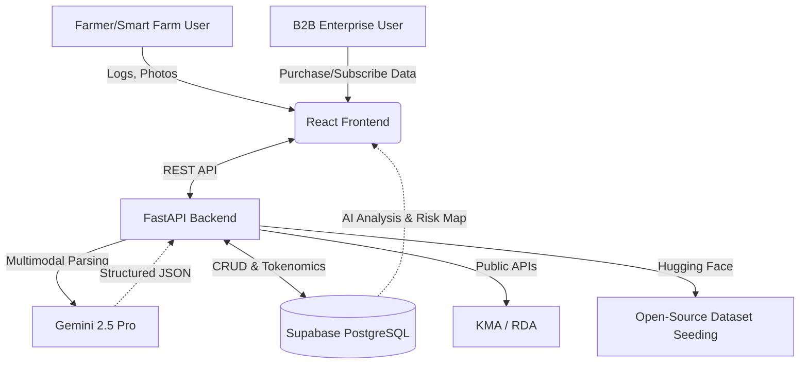

# MDGA (Universal Data Engine) 🚀

[🇰🇷 한국어](README.md) | [🇺🇸 English](README_EN.md)

**Next-Generation Agricultural/Smart Farm Specialized Data Pipeline & B2B Marketplace**

MDGA is a platform that combines handwritten farming logs, crop growth data, and external public weather data to **generate high-quality synthetic data and provide Agricultural AX (AI Transformation) insights**. We support everything from quarantine and mortality risk monitoring for pig farms, to AI-driven yield recommendations based on sales analysis for smart farms, to direct B2B matching for B-grade (ugly) produce with local small businesses.

## 🌟 Core Features

1. **AI Data One-Touch Converter**
   - Automatically converts handwritten logs, vaccination records, and on-site photos (via camera or voice input) into government-standard (e.g., HACCP) JSON data and loads them into the DB.
2. **Twin Map Risk Insight**
   - Visualizes the boundaries of infectious diseases (like African Swine Fever, Foot-and-Mouth Disease) and real-time environmental risks (heat waves, ventilation indices) on a live map.
3. **B-grade Produce B2B Market**
   - A direct transaction channel matching 'ugly crops' with low marketability to local small businesses for processing (bakeries, juice bars, etc.).
4. **Synthesis Insight & Open-Source AI Management**
   - **For Farmers:** Golden-time alarms for livestock heatstroke mortality, growth environment monitoring, and integrated sales analysis for AI yield recommendations.
   - **For Enterprise:** Generation and trading of synthetic data for Vision/Autonomous Driving AI using open-source models (AgiBot, EnvHub, RoboCasa).

## 📚 Documentation
For detailed architecture, planning, and API specifications, please refer to the `docs/` folder.
- 👉 **[View MDGA Integrated Document Index (docs/README.md)](docs/README.md)** *(Currently in Korean)*

## 🏗️ System Architecture
- **Frontend**: React 19, Vite, Tailwind CSS, Framer Motion (Deployed on Cloudflare Pages)
- **Backend**: Python 3.11, FastAPI, SQLAlchemy 2.0 (Deployed on Render.com)
- **Database**: PostgreSQL (Supabase)
- **AI / Data**: Gemini 2.5 Pro (Multimodal Parsing & Analysis)



## 🚀 Getting Started

### Environment Variables (`backend/.env`)
```env
DATABASE_URL=postgresql://[user]:[password]@[host]:6543/postgres
GEMINI_API_KEY=your_gemini_api_key
```

### Run Local Server
```bash
# Unified run script (Backend on 8080, Frontend on 5173 concurrently)
./dev.sh
```

---
*MDGA - Empowering the Future of Agricultural Transformation.* 🌾
