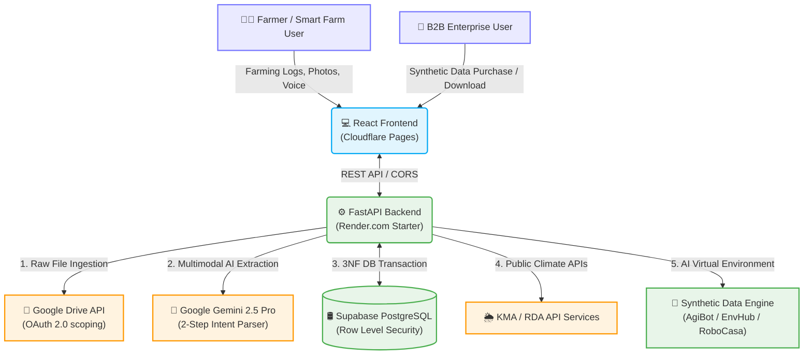

# MDGA (Universal Data Engine) 🌾🚀

<div align="center">
  
  
  <br />

  [](https://fastapi.tiangolo.com/)
  [](https://react.dev/)
  [](https://tailwindcss.com/)
  [](https://www.postgresql.org/)
  [](https://deepmind.google/technologies/gemini/)

  <h3>Next-Generation Agricultural/Smart Farm Specialized Data Pipeline & B2B Synthetic Data Marketplace</h3>

  <p>
    MDGA is an enterprise-grade platform that combines fragmented manual farming logs, crop growth data, and external public data to <strong>generate high-quality intelligent synthetic data (Synthetic Data) and provide Agricultural AX (AI Transformation) insights</strong>.
  </p>
</div>

---

## 📅 Project Timeline & Milestones

This project was developed for the **2026 Daegu Regional Strategic Industry Problem Solving Intellectual Property Living Lab** competition. The project has been successfully completed, evaluated, and fully archived.

* **Total Project Period**: **March 16, 2026 ~ May 31, 2026** (Official repository closing)
* **Key Milestones**:

<details>
<summary><b>⏱️ View Detailed Development & Activity Milestones (Click to expand)</b></summary>
<div markdown="1">

* 📅 **2026.03.16**: Registration submitted with initial business plan & project proposal (Idea Build-up)
* 📅 **2026.04.29**: Submitted intermediate activity report & 1st meeting minutes
* 📅 **2026.04.30**: Intermediate evaluation presentation & 1st MVP demo (Data Converter, Twin Map prototypes)
* 📅 **2026.05.17**: Intellectual Property (IP) consultation meeting with patent attorney for patentability review
* 📅 **2026.05.18**: Submitted final activity report & comprehensive meeting minutes
* 📅 **2026.05.19**: **Final Evaluation & Main Pitch Presentation** (Full integration demo with Hugging Face real-world datasets, real-time AI crop grading, and wallet integration MVP)
* 📅 **2026.05.31**: Final project closing and repository organization completed for GitHub upload

</div>
</details>

---

## 🎬 Demo Video & Presentation Slides Showcase

> [!TIP]
> We have designed **interactive mockup containers** to present the demo videos and presentation slides beautifully directly on GitHub. Click on the image cards below to play the videos on YouTube or view the PDF reports!

<table width="100%">
  <tr>
    <td width="50%" align="center">
      <h4>🏆 Final Pitch Presentation Demo (Final Demo Video)</h4>
      <a href="https://www.youtube.com/watch?v=KS7ftQ3nPoo&t=46s" target="_blank">
        
      </a>
      <p><i>(Final pitch & full-pipeline demonstration - Click to play on YouTube)</i></p>
      <sub>※ Local path of raw video: <a href="file:///Volumes/samsd/workspace_v2/livinglab_2026/docs/05_Competition_Deliverables/02_Final/[MDGA_리빙랩_최종] 시연영상.mp4">docs/05_Competition_Deliverables/02_Final/[MDGA_리빙랩_최종] 시연영상.mp4</a></sub>
    </td>
    <td width="50%" align="center">
      <h4>⏱️ Intermediate Milestone Demo (Intermediate Demo Video)</h4>
      <a href="https://youtu.be/bFC9kAiN40U" target="_blank">
        
      </a>
      <p><i>(Intermediate evaluation & MVP prototype demonstration - Click to play on YouTube)</i></p>
      <sub>※ Local path of raw video: <a href="file:///Volumes/samsd/workspace_v2/livinglab_2026/docs/05_Competition_Deliverables/01_Intermediate/[MDGA_리빙랩_중간] 시연영상.mp4">docs/05_Competition_Deliverables/01_Intermediate/[MDGA_리빙랩_중간] 시연영상.mp4</a></sub>
    </td>
  </tr>
</table>

<br />

<div align="center">
  <h4>📊 Final Presentation Slides & Activity Reports</h4>
  <a href="./docs/05_Competition_Deliverables/02_Final/[MDGA_리빙랩_최종] 발표보고서.pdf" target="_blank">
    
  </a>
  <p><i>(Click the slide card above to view the PDF report natively on GitHub)</i></p>
  <sub>※ Local path of PowerPoint source: <a href="file:///Volumes/samsd/workspace_v2/livinglab_2026/docs/05_Competition_Deliverables/02_Final/[MDGA_리빙랩_최종] 발표자료.pptx">docs/05_Competition_Deliverables/02_Final/[MDGA_리빙랩_최종] 발표자료.pptx</a></sub>
</div>

---

## 🌟 Core Features

<table width="100%">
  <tr>
    <td width="50%" valign="top">
      <h3>1. AI Data One-Touch Converter ✍️</h3>
      <p>When a farmer takes a photo of handwritten logs, vaccination lists, or on-site notes, the Google Gemini 2.5 Pro Multimodal AI parses and structures it in real time into government-standard (e.g., HACCP) JSON format in a single second.</p>
    </td>
    <td width="50%" valign="top">
      <h3>2. Twin Map Quarantine/Environment Monitor 🗺️</h3>
      <p>Locally collected farmer logs are automatically scaled and rolled up into region-level datasets to visualize infectious disease boundaries (e.g., African Swine Fever) and climate risks (e.g., heatstroke threshold index) on an interactive live map (Leaflet.js).</p>
    </td>
  </tr>
  <tr>
    <td width="50%" valign="top">
      <h3>3. B-grade Produce B2B Marketplace 🍎</h3>
      <p>Uploading pictures of B-grade (ugly) crop immediately triggers a real-time vision grading analysis (sugar content, A/B/C tier) and matches them to local juice bars or bakeries. Settlement is automatically handled by the local Tokenomics Wallet.</p>
    </td>
    <td width="50%" valign="top">
      <h3>4. Intelligent B2B Synthetic Data Engine 🤖</h3>
      <p>Using real farming inputs, the engine runs climate simulation algorithms to output high-fidelity synthetic training data for world-class virtual physical systems like AgiBot, EnvHub, and RoboCasa for B2B dataset trading.</p>
    </td>
  </tr>
</table>

---

## 🏗️ System Architecture

MDGA's live deployment runs seamlessly on a fully managed PaaS infrastructure: **FastAPI ➔ Render.com / React ➔ Cloudflare Pages / Database ➔ Supabase / Storage ➔ Google Drive API / AI ➔ Google Gemini Pro**.



---

## 🛠️ Technology Stack

| Tier | Open-Source Technology | Description |
| :--- | :--- | :--- |
| **Frontend** | React 19, Vite, Tailwind CSS, Framer Motion, Leaflet.js | High-fidelity responsive dashboard, modern design system, and mapping |
| **Backend** | Python 3.11, FastAPI, SQLAlchemy 2.0, Uvicorn | Fully asynchronous REST APIs, secure 3NF relational transactions |
| **Database** | PostgreSQL (Supabase) | FK integrity, `ON DELETE CASCADE` actions, and RLS security policies |
| **AI / Data** | Google Gemini 2.5 Pro Vision, Hugging Face, Pandas | Advanced multimodal prompt engineering, real data seeding pipeline |
| **DevOps** | Render (Backend), Cloudflare Pages (Frontend), GitHub Actions | Continuous integration & deployment pipelines (CI/CD) with PaaS |

---

## 📚 Document Index

The comprehensive listing of technical and planning specifications is maintained on the master portal page: 👉 **[View MDGA Integrated Document Index (docs/README.md)](./docs/README.md)**.

```text
docs/
├── README.md                   # Integrated document portal page (Index)
├── 00_Overview/                # Project planning specs & Portfolio interview guidelines
├── 01_Requirements_&_Design/   # Persona specifications, competitor analysis, business rules, user flows
├── 02_Architecture_&_API/      # System architecture, DB ERD schemas, REST & External API specs
├── 03_Infrastructure/          # Deployed servers specs, environment variables guides, security, and roads
├── 04_Research_&_Feedback/     # Pig/Smart farm detailed interview logs, Patent attorney advisory minutes
└── 05_Competition_Deliverables/ # 🏆 Proposal docs, intermediate & final slides/reports, demo videos, cardnews
```

---

## 🚀 Getting Started

### 1. Environment Variables (`backend/.env`)
```env
DATABASE_URL=postgresql://[user]:[password]@[host]:6543/postgres
GEMINI_API_KEY=your_gemini_api_key_here
```

### 2. Run Locally
Execute the unified development shell script:
```bash
# Concurrently runs FastAPI Backend (8080) and React Frontend (5173)
./dev.sh
```

---
*MDGA - Empowering the Future of Agricultural Transformation.* 🌾
