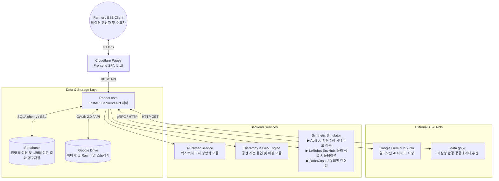
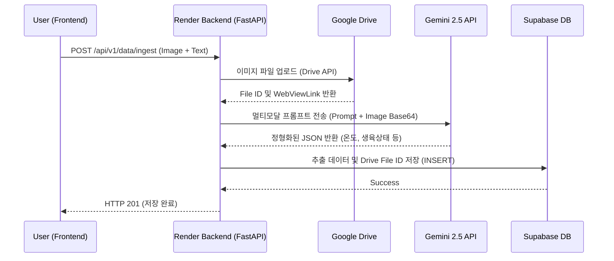

# MDGA (Universal Data Engine) - 시스템 아키텍처 (System Architecture) v2.1

본 문서는 MDGA 프로젝트의 라이브 인프라스트럭처 배포 현황과 시스템 구성, 시퀀스 흐름을 상세히 정의합니다.

## 1. 하이레벨 아키텍처 (High-Level Architecture)

MDGA는 이미 상용 수준의 PaaS/SaaS 인프라에 배포가 완료된 상태로 운영됩니다. 모든 기능은 배포된 인프라(Render, Supabase, Cloudflare Pages, Google Drive) 상호작용 속에서 테스트되고 검증되어야 합니다.

## 2. 배포된 인프라 상세 (Live Infrastructure Details)

### 2.1 Frontend: Cloudflare Pages
*   **기술 스택:** React 19, Vite, Tailwind CSS, Zustand, Leaflet.js
*   **배포 방식:** GitHub 저장소 Main 브랜치 푸시 시 Cloudflare Pages가 자동 빌드(Vite) 및 글로벌 CDN 엣지에 배포.
*   **역할:** 사용자 인터페이스 및 Twin Map 시각화. Render 서버로 HTTPS API 요청 수행.

### 2.2 Backend: Render.com (Web Service)
*   **기술 스택:** FastAPI, Python 3.11+
*   **배포 방식:** Dockerfile 기반 웹 서비스 배포. GitHub Main 머지 시 자동 트리거 됨.
*   **역할:** 비즈니스 로직(AI 파싱, 롤업, 시뮬레이션) 수행, 외부 API(기상청, Gemini, Google Drive) 통신, Supabase 쿼리 등 중앙 통제.

### 2.3 Database: Supabase (Managed PostgreSQL)
*   **기술 스택:** PostgreSQL 15+, PostgREST(필요시)
*   **역할:** 영농일지, 사용자 계정, 공간 계층(Region/Farm) 및 시뮬레이션 데이터 영구 저장.

### 2.4 Data Lake (Storage): Google Drive
*   **역할:** 사용자가 업로드하는 영농일지 이미지 파일 등 대용량 비정형 데이터를 저장.
*   **보안:** `auth/drive.file` 스코프의 최소 권한 원칙(OAuth)을 적용하여 MDGA 앱이 직접 생성한 파일만 읽고 쓸 수 있도록 격리.

## 3. 핵심 아키텍처 제약 및 QA 정책 (Architecture Constraints & QA Policy)

### 🚨 Production-First Testing Policy (배포 환경 테스트 필수)
1.  로컬호스트(`localhost:8000`, `localhost:5173`)에서의 작동은 단순 개발 단계의 확인용일 뿐입니다.
2.  **테스트 통과 조건:** 모든 PR/기능 추가는 GitHub Actions CI 통과 후 Main에 머지되어 **Cloudflare Pages URL**과 **Render Backend URL**이 완전히 배포(Live)된 상태에서 이뤄지는 E2E 테스트를 거쳐야 비로소 완료(Done)된 것으로 간주합니다.
3.  CORS, Supabase SSL 연결, Google Drive OAuth 권한 제어 등은 실 배포 환경에서만 정확한 검증이 가능합니다.

## 4. 코어 시퀀스 (Data Ingestion with Google Drive)

