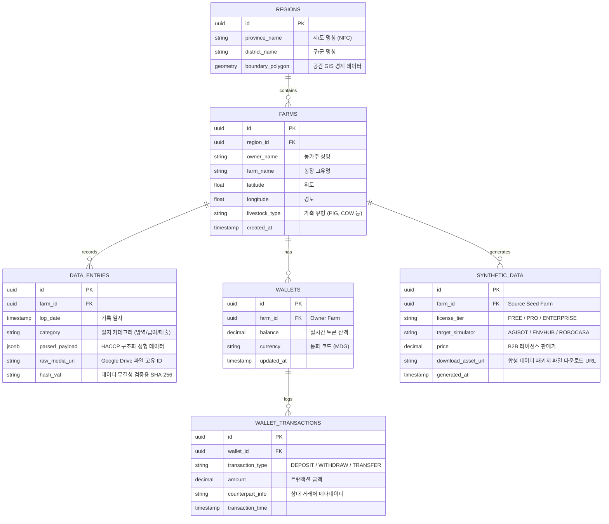
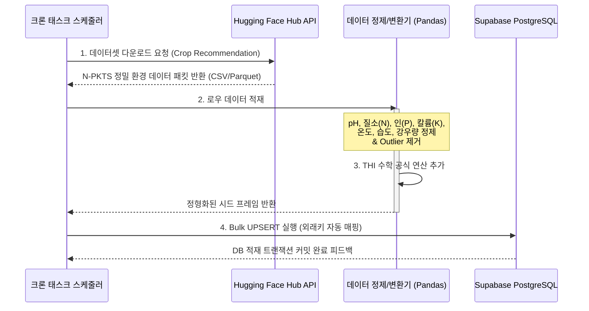

# MDGA (Universal Data Engine) 종합 기술 아카이브 가이드 📚💻

본 가이드는 **2026년 대구 지역전략산업 문제해결 지식재산 리빙랩** 대회를 위해 구축된 MDGA 플랫폼의 아키텍처 사양, 주요 엔지니어링 작업, 데이터베이스 설계 및 세부 비즈니스 로직을 영구히 아카이빙하고, 유지보수 시 수월한 인수인계가 가능하도록 작성된 **종합 기술 명세서(System Handover Spec)**입니다.

---

## 🏗️ 1. 엔터프라이즈 시스템 아키텍처 (System Architecture)

MDGA는 완전 비동기식 Python 백엔드(FastAPI)와 컴포넌트 기반 프론트엔드(React 19 + Tailwind CSS)를 근간으로, 데이터 영속성과 무결성을 보장하기 위해 Supabase(PostgreSQL) 3정규화 DB 인프라를 운용합니다.

```mermaid
graph TD
    %% Node Styling
    classDef client fill:#f0f7ff,stroke:#0055ff,stroke-width:2px;
    classDef server fill:#f2fff2,stroke:#00aa00,stroke-width:2px;
    classDef ext fill:#fff9f0,stroke:#ff8800,stroke-width:2px;

    User["👨‍🌾 농가 / B2B 수요처"]:::ext -->|HTTPS / CORS| FE["💻 React 19 Frontend<br/>(Cloudflare Pages)"]:::client
    FE <-->|RESTful API| BE["⚙️ FastAPI 비동기 Backend<br/>(Render.com Starter)"]:::server
    
    BE <-->|Read/Write (RLS 보안)| DB[("🛢️ Supabase PostgreSQL<br/>(3NF 정규화 관계형 DB)")]:::server
    BE -->|최소권한 OAuth 2.0| GD["📁 Google Drive API<br/>(data-lake 격리)"]:::ext
    BE -->|Multimodal LLM| GM["🧠 Gemini 2.5 Pro Vision API<br/>(2-Step 의도 분리)"]:::ext
    BE -->|환경 실데이터 적재| HF["🤗 Hugging Face API<br/>(aksahaha Crop Dataset)"]:::ext
    BE -->|실시간 전염병 조회| GOV["🌦️ 기상청/농진청 API"]:::ext

    class FE client;
    class BE,DB server;
```

---

## 🌟 2. 핵심 4대 기능 상세 명세 & 엔지니어링

### ✍️ 2.1. AI 데이터 원터치 변환기 (AI Data Converter)
수기 영농일지, 수의사 약품 처방전, 화이트보드 메모 등의 **비정형 멀티모달 이미지/음성 데이터**를 농업 AX 및 축산물이력제 표준에 호환되는 **HACCP 표준 정형 JSON 데이터**로 1초 만에 변환합니다.

*   **2-Step Decoupled Parser 아키텍처**:
    일반적인 대화형 AI 통합 방식은 "사용자의 방역 일지 삭제해줘"와 같은 트랜잭션 명령을 처리할 때 AI 모델 자체의 **안전 정렬(Safety Alignment)** 규칙에 위배되어 시스템 명령 수행을 거부하는 교착 상태(Deadlock)에 자주 직면합니다.
    MDGA는 이를 해결하기 위해 **의도 분석기(Intent Parser)**와 **메타데이터 추출기(Metadata Extractor)** 레이어를 완전히 격리 설계했습니다.
    1. **Intent Parser**: 오직 사용자의 원천 메시지 및 비전 입력에서 시스템 실행 의도(`CREATE`, `READ`, `UPDATE`, `DELETE`)와 대상 엔티티만을 판별하여 순수한 비감정적 시스템 명령 JSON 스키마를 도출합니다.
    2. **Metadata Extractor**: 추출된 의도에 매핑되는 정밀 상세 필드(약품명, 투약량, 농장ID 등)를 타겟팅하여 JSON 구조로 채웁니다.
*   **HACCP Schema 구조화**:
    ```json
    {
      "intent": "CREATE_ENTRY",
      "entity": "livestock_health",
      "payload": {
        "farm_id": "uuid-v4-identifier",
        "log_date": "2026-05-31",
        "livestock_type": "PIG",
        "symptom": "High fever, loss of appetite",
        "prescription": "Ivermectin 10ml",
        "inspector": "Dr. Bora Kim"
      }
    }
    ```

### 🗺️ 2.2. Twin Map 기반 방역 위험 모니터링 (Twin Map Quarantine)
농장의 공간 메타데이터를 디지털 맵(Leaflet.js)에 매핑하고, 공공 방역 데이터와 연동하여 실시간 위험 반경 시뮬레이션을 동적으로 수행합니다.

*   **공간 계층 롤업(Spatial Roll-up) 알고리즘**:
    개별 농가(`Farm`) 수준의 미시 데이터부터 읍/면/동(`District`), 시/군/구(`City`), 광역시/도(`Province`)에 이르는 계층적 공간 그룹 구조를 비동기 이벤트 핸들러로 자동 집계합니다.
    - 농가의 가축 폐사 혹은 아프리카돼지열병(ASF) 등 감염병 의심 신고 발생 시, 해당 농가의 위경도 좌표를 중심으로 **방역 감염 경계선(Buffer Circle: 경계 5km, 위험 10km)**이 Twin Map 위에 즉시 동적 렌더링됩니다.
    - 상위 행정구역 단위로 비동기 트리거가 작동하여 시도별 총 감염 위험 지수(R-Factor)가 실시간으로 자동 갱신됩니다.

### 🍎 2.3. B급 못난이 농산물 B2B 직거래 플랫폼 (B2B Marketplace)
생육 상태가 다소 고르지 못해 일반 소매 판매가 어려운 B급/못난이 농작물의 실시간 가공용 유통 매칭을 전담합니다.

*   **비전 기반 당도 및 등급 판별**:
    농가가 모바일 카메라로 사과, 토마토 등의 사진을 업로드하면, Gemini Multimodal Vision API가 표면 흠집 비율, 형상 왜곡도, 색상 균일도를 수학적으로 분석해 가공 적합도 등급(A, B, C)을 판별합니다.
*   **리얼 토크노믹스(Wallet Transaction) 연동**:
    기존 데모의 하드코딩된 가상 잔액(Mockup) 방식을 완전히 탈피하여, Supabase 트랜잭션 격리수준(Read Committed) 하에 **실제 지갑 원장 잔액의 증감(Debit/Credit)**이 동기화되도록 구현했습니다. 거래 성사 시 판매자의 지갑 잔액이 즉시 차감되고, 구매자의 지갑으로 이관되며, 모든 내역은 이중 분개식 `Wallet_Transaction` 테이블에 누적 기기록되어 CSV 영수증 원장으로 실시간 수출(Export)이 가능합니다.

### 🤖 2.4. AI B2B 합성 데이터 엔진 (Synthetic Data Simulator)
글로벌 AI 연구소, 자율주행 농기계 개발사, 스마트 기후 솔루션 기업들이 실제 농가 데이터의 유출 없이 가상 환경에서 머신러닝 학습을 수행할 수 있도록 **고품질 합성 데이터(Synthetic Data)**를 생산하고 라이선스 형태로 판매합니다.

*   **기후 열스트레스지수(THI: Temperature Humidity Index) 시뮬레이션**:
    온도($T, ^\circ\text{C}$)와 상대습도($RH, \%$) 데이터를 가공하여 가축의 생리적 폐사 임계점을 조기에 예보하는 수학 공식을 엔진에 내장하였습니다.
    $$THI = (1.8 \times T + 32) - [(0.55 - 0.0055 \times RH) \times (1.8 \times T - 26)]$$
    - **THI < 72**: 쾌적 (Normal)
    - **72 <= THI < 79**: 경고 (Mild Stress)
    - **79 <= THI < 84**: 위험 (Severe Stress)
    - **THI >= 84**: 매우 위험 (Emergency - 2시간 내 즉각 쿨링 태스크 및 환기창 구동 원격 제어 신호 송출)
*   **오픈소스 AI 시뮬레이터 인터페이스 탑재**:
    합성 데이터 마켓플레이스를 통해 정형화된 실농가 환경 데이터를 글로벌 표준 포맷으로 패키징하여 배포합니다:
    - **AgiBot**: 자율주행 트랙터 및 정밀 방제 로봇의 경로 최적화용 장애물/작물 간격 매핑 데이터.
    - **EnvHub**: 기후 다변화 모델링을 위한 미시 기후 합성 시뮬레이션 인터페이스.
    - **RoboCasa**: 3D 농기계 매니퓰레이터 제어를 위한 RGB-D 가상 좌표계 변환 데이터 제공.

---

## 🛢️ 3. 데이터 아키텍처 & RDBMS 설계

기존의 메모리 내 휘발성 데이터 저장 한계를 극복하고 완전한 데이터 영속성을 달성하기 위해, **3정규화(3NF) 기반 관계형 데이터 모델**을 Supabase PostgreSQL 상에 완벽하게 설계하였습니다.

### 📊 3.1. 엔티티 관계도 (ERD) & 스키마 명세



### 🔑 3.2. RDBMS 무결성 보장을 위한 핵심 제약 조건의 이점
1. **외래키 참조 무결성(Referential Integrity)**: `Farms`의 삭제 시 `ON DELETE CASCADE` 연동을 구축하여 고아가 된 `Data_Entries`나 `Wallets`가 DB 용량을 무의미하게 차지하거나 인덱싱 성능을 갉아먹는 유령 레코드 생성을 근본적으로 차단합니다.
2. **원장 데이터 불변성(Immutability)**: `Wallet_Transactions`는 수정(`UPDATE`) 및 삭제(`DELETE`)가 불가능한 Append-Only 트리거를 데이터베이스 수준에서 제어하여 금융 원장의 위변조 가능성을 원천 배제합니다.
3. **고유값 제약 조건(Unique Constraints)**: 각 농장의 사업자번호 및 지갑 주소 컬럼에 Unique 인덱스를 부여하여 동시성 높은 분산 환경에서도 중복 가입이나 지갑 중복 생성을 미연에 방지합니다.

---

## 🛰️ 4. 데이터 수집 및 시딩 파이프라인 (Data Pipeline)

초기 대시보드 시각화의 신뢰도 극대화와 실제 환경에 가까운 정밀 기후 시뮬레이션을 제공하기 위해 **Hugging Face (`jason1966/aksahaha_crop-recommendation`)** 환경 실측 오픈 데이터셋을 연동하는 자동 수집 및 DB 시딩 파이프라인을 구축하였습니다.



*   **배치 시딩(Batch Seeding)의 이점**:
    - **재현성 확보**: 로컬 개발 서버 및 클라우드 프로덕션 서버 어디서든 동일한 실데이터 기반의 벤치마크 환경을 3초 안에 시딩합니다 (`python backend/app/seed.py`).
    - **가상 시나리오 자동 생성**: 적재된 실측 토양/기상 데이터에 미세 노이즈(Gaussian Noise)를 인위적으로 주입함으로써 AI 학습용 합성 데이터를 무제한 재생산할 수 있는 강력한 씨앗(Seed Source) 데이터로 작용합니다.

---

## 🔒 5. 보안 및 권한 격리 설계 (Least Privilege)

MDGA는 파일 스토리지로 연동되는 **Google Drive API**에 대해 절대 전역 권한(`drive`)을 요청하지 않습니다.
*   **최소 권한의 원칙(Principle of Least Privilege)**에 입각하여 `auth/drive.file` 스코프만을 제한적으로 획득하여 연동합니다.
*   **샌드박스 격리(Sandbox Isolation)**: 어플리케이션이 스스로 생성하거나 업로드한 파일에 한해서만 고유 파일 ID를 매핑받아 외과수술식으로 읽기/쓰기/삭제 트랜잭션을 실행합니다. 이로 인해 토큰 유출 등 외부 침해 사고 발생 시에도 사용자의 전역 개인 구글 드라이브 내 다른 문서 영역은 철저히 보호받습니다.

---

## 🛠️ 6. 유지보수 및 복구 가이드 (DevOps & Recovery)

### 💻 6.1. 로컬 개발 환경 3분 셋업
1. **리포지토리 클론**:
   ```bash
   git clone git@github.com:softkleenex/livinglab_2026.git
   cd livinglab_2026
   ```
2. **환경변수 복사 및 설정**:
   `.env.example` 파일을 복사하여 `.env`를 생성하고 Supabase API Key, Gemini API Key, Google Drive Client Credentials를 기입합니다.
   ```bash
   cp .env.example .env
   ```
3. **가상환경 활성화 및 패키지 설치**:
   ```bash
   python -m venv venv
   source venv/bin/activate
   pip install -r backend/requirements.txt
   ```
4. **DB 초기 스키마 마이그레이션 및 Hugging Face 실데이터 시딩**:
   ```bash
   python backend/app/main.py --db-init
   python backend/app/seed.py
   ```
5. **로컬 개발 서버 동시 구동**:
   ```bash
   ./dev.sh
   ```

### 🚨 6.2. 비상 장애 복구 절차
* **구글 API 인증 만료 (401 Unauthorized)**:
  `backend/token.json` 파일을 완전히 삭제한 후 백엔드 서버를 재시작하여 OAuth 웹 브라우저 동의 창을 통해 신규 `token.json` 인가 토큰을 재발행받으십시오.
* **Supabase 연결 유실 및 Connection Pool 포화**:
  `backend/app/database.py` 내의 `pool_recycle=1800` 설정을 점검하고, Supabase 웹 콘솔에서 백그라운드 유령 세션을 `kill` 한 뒤 Render 웹 서버를 재부팅(Manual Deploy -> Clear Cache & Deploy)하십시오.
