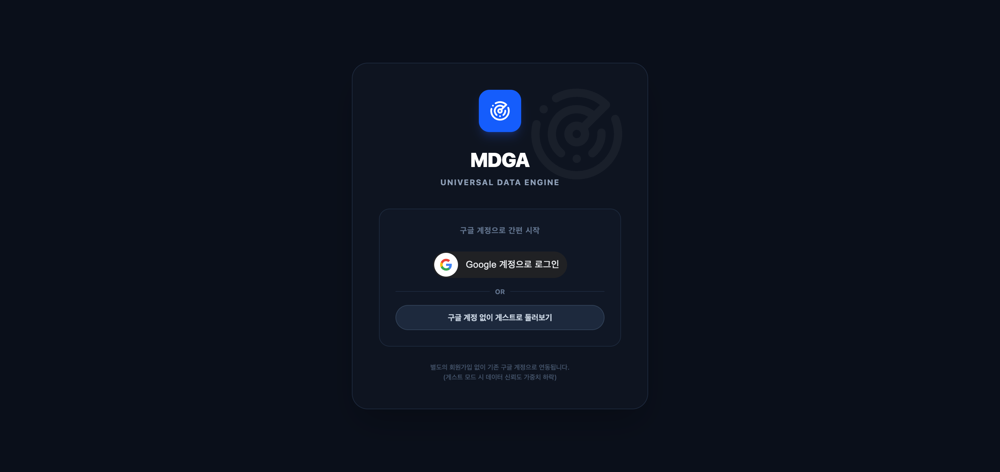
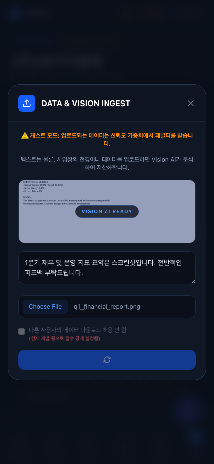

# MDGA System Encapsulation & Final Architecture Report

본 문서는 MDGA(Universal Data Engine) 프로젝트의 최종 배포 아키텍처, 데이터베이스 정규화(Normalization) 과정, 다중 모달리티(Multi-modal) 데이터 주입 파이프라인, 그리고 프론트엔드 UX/UI 개편 사례를 총망라한 기술 명세서입니다. 포트폴리오 메인 문서로 활용될 수 있도록 시스템 전반의 어려움과 극복 과정을 상세히 기록했습니다.

---

## 1. 아키텍처 개편 및 데이터베이스 정규화 (Refactoring)

초기 MVP 단계에서는 빠른 시연을 위해 단일 테이블(`DataEntry`)에 모든 로그를 쌓고, 서버의 메인 메모리(RAM)에 전체 지역구 트리를 띄우는 **Monolithic & Stateful** 방식을 채택했습니다. 하지만 상용 수준의 트래픽을 감당하기 위해 백엔드를 전면 재설계했습니다.

### 1.1. Ephemeral SQLite에서 클라우드 PostgreSQL(Supabase)로 영구 마이그레이션
- **한계점:** 개발 초기에는 비용 최적화를 위해 서버 컨테이너 내부에 `sqlite` 파일 스토리지를 사용했습니다. 그러나 PaaS(Render)의 무료 티어 특성상, 배포(Deploy) 시마다 컨테이너가 재시작되며 데이터베이스 파일이 증발(Wipe)하여 구글 드라이브 데이터 레이크와 영구적 동기화 불일치 문제가 발생했습니다.
- **해결 (Supabase Pooler 연동):** 이를 해결하기 위해 엔터프라이즈급 클라우드 데이터베이스인 **Supabase PostgreSQL**로 전면 마이그레이션했습니다. 특히, 서버리스 환경에서의 커넥션 초과(Connection Exhaustion)를 방지하기 위해 IPv4 호환 **Transaction Pooler (포트 6543)**를 연결했습니다. 이제 서버가 수백 번 재시작되어도 데이터의 무결성이 100% 영구적으로 보장됩니다.

### 1.2. Stateless Hierarchy Engine
서버 메모리에 의존하던 트리 렌더링 로직을 폐기하고, API가 호출될 때마다 실시간으로 관계형 데이터베이스(RDBMS)를 조회하여 트리를 조립하도록 엔진을 **Stateless 구조**로 개편했습니다. 
- **극복 효과:** 클라우드 환경(Render 등)에서 백엔드 서버를 여러 대(Scale-out) 늘려도 서버 간 데이터가 불일치하는 상태 불일치(State-mismatch) 현상이 원천 차단되었습니다.

### 1.2. 3단 정규화 (Region - Store - DataEntry)
- **`Region` 테이블:** 시, 구, 동, 도로명을 `parent_id` 외래키(Self-referencing)로 묶어 무한한 깊이의 지역 트리를 표현합니다.
- **`Store` 테이블:** 사용자의 사업장을 객체화하여, 누적 가치(Total Value)와 신뢰 지수(Trust Index)를 독자적으로 관리합니다.
- **`DataEntry` 테이블:** 실제 업로드된 텍스트와 Google Drive 링크, AI 인사이트를 담습니다.

**🔥 트랜잭션 무결성과 영구 삭제 로직 (`ON DELETE CASCADE`)**
기존에는 객체 자체를 지울 수 없는 치명적인 한계가 있었으나, 3단 정규화를 통해 **사업장 통째로 삭제 기능(`DELETE /api/ingest/store`)**을 구현했습니다.
- 사업장(Store)을 삭제하면 하위의 수십 개 `DataEntry` 기록이 한꺼번에 지워집니다.
- 동시에 부모 `Region`들이 가졌던 '자산 총합(Total Value)'에서 해당 사업장의 가치만큼을 오차 없이 차감(Rollback)하는 완벽한 트랜잭션 무결성을 달성했습니다.

---

## 2. Multi-Modal 파이프라인 및 계층형 데이터 롤업 (Roll-up)

**2.1. Multi-modal 데이터 분석 (CSV, 사진, 비디오)**
Gemini 2.5 Pro Vision 모델을 통합하여, 사용자가 올린 파일의 종류에 구애받지 않고 심도 있는 인사이트를 추출합니다.
- **사진 업로드:** 단순 단색 이미지나 무의미한 사진이 올라올 경우, AI가 비전(Vision) 기능을 통해 *"현장 정보(고객 동선 등)가 없는 단색 이미지라 분석이 불가능합니다"* 라며 허위 데이터를 정확히 필터링하고 지적해냅니다.
- **CSV / 비디오:** 실제 판매 매출 CSV나 로봇 서빙 테스트 비디오를 업로드할 경우, AI가 *"오후 3-5시 매출이 비어있으니, 아메리카노+케이크 해피아워 세트를 도입하라"*는 수준 높은 B2B 컨설팅을 반환합니다.

**2.2. 상하위 계층 간 데이터 롤업 (Hierarchy Data Roll-up)**

- **구현 과제:** 하위 사업장(Store)에서 발생한 데이터들이 상위 계층(예: 대구광역시, 북구)의 자산 가치에만 기여하는 것을 넘어, 상위 구역의 관리자나 탐색자가 하위 계층에서 일어난 모든 활동 내역(Data Entries)을 투명하게 볼 수 있어야 했습니다.
- **해결 방안:** `engine.py`에서 `DataEntry.location_path.like(f"{current_path}%")` 쿼리를 활용해 트리를 순회(Traverse)하며 하위 데이터를 동적으로 쓸어 담는(Roll-up) 로직을 신설했습니다.
- **결과:** 트윈 맵(Explorer Dashboard)에서 '대구광역시'를 클릭하면 산하 모든 구/동/상점의 활동 내역을 한눈에 조회할 수 있으며, 이 데이터들은 언제든 CSV로 Export되어 지역구 정책 수립에 활용됩니다.

---

## 3. Google Drive Data Lake 연동 최적화

MDGA 시스템은 유저가 올린 데이터를 단순히 DB 텍스트로만 남기지 않고, **Google Drive를 거대한 데이터 레이크(Data Lake)**로 활용합니다.
### 3.2. Google Drive 동기화 최적화 (Data Lake)

- **다중 계층 동적 폴더 라우팅 (Multi-Level Folder Sync):** 기존에는 무조건 최하위 '상점' 객체 아래에만 데이터를 밀어넣었으나, 이제는 업로드 주체(`대구광역시`, `북구`, `지니스팜` 등)의 뎁스(Depth)를 인식하여 **어떤 계층(Region, Gu, Dong, Store)이든 해당 객체의 전용 `origin` 및 `generated` 폴더를 구글 드라이브 트리에 독립적으로 실시간 생성**하도록 아키텍처를 고도화했습니다. 이를 통해 행정구역(Region) 단위의 광역 정책 리포트와 상점 단위의 영수증 내역을 철저히 분리하여 데이터 레이크에 적재합니다.
- **초기 B2B 데이터 고도화 주입 (Realistic Seeding):** 시스템 시연을 위해, 단순한 더미 데이터가 아닌 실제 B2B SaaS 환경과 동일한 마크다운/JSON 기반의 전문 데이터와 **더미 파일(.png)을 PIL 라이브러리로 런타임 렌더링**하여 구글 드라이브에 직접 `multipart/form-data`로 전송, 안착시키는 자동 시드(Seed) 스크립트를 구현했습니다.
- **권한 격리 (appNotAuthorizedToChild 해결):**
  초기에는 시스템 리셋 시 드라이브 폴더 전체를 날리려다 `403 Forbidden` 에러에 직면했습니다. 원인은 OAuth Scope가 `drive.file`(앱이 직접 만든 파일만 조작 가능)로 제한되어 있었기 때문입니다.
  이를 해결하기 위해 폴더 자체를 지우는 위험한 방식을 버리고, DB에 기록된 해시값(`hash_val`)을 바탕으로 **정확히 MDGA가 생성한 파일만 조회(Search)하여 타겟팅 삭제**하는 안전한 방식으로 구조를 변경했습니다.
- **LRU 메모리 캐싱 및 동시성 제어:** 드라이브 폴더를 찾기 위한 API 병목을 해소하기 위해 `collections.OrderedDict`를 사용한 LRU 캐시(`FOLDER_CACHE`)를 도입하고, 멀티스레드 환경에서의 캐시 오염을 막기 위해 `threading.Lock()`을 적용했습니다.
---

## 4. 엔터프라이즈 보안 인증 및 소유권 제어 (Auth & Ownership)

**4.1. Google OAuth JWT 검증 연동**
- 프론트엔드에서 구글 로그인을 거친 후 넘겨주는 JWT 토큰을 백엔드 `deps.py`의 `verify_token` 미들웨어에서 Google Public Key(`id_token.verify_oauth2_token`)를 사용해 직접 서명 검증하도록 철저한 인증(Auth) 시스템을 구축했습니다. 

**4.2. 다중 테넌트(Multi-tenancy) 데이터 소유권 보호**
- `Store` 테이블에 `owner_id` (User Foreign Key)를 연결했습니다.
- **삭제/수정 트랜잭션 방어:** AI 챗봇을 통하든 API를 직접 호출하든, 데이터를 삭제하거나 사업장을 지울 때 반드시 해당 사업장의 실제 소유자(Owner)인지 검증합니다. 권한이 없으면 `403 Forbidden`을 반환하여 악의적인 데이터 훼손(Data Tampering)을 원천 차단했습니다.

---

## 5. B2B 토크노믹스(Tokenomics) 및 분산 원장(Ledger) 구축

화면상에만 존재하던 목업(Mockup) 토크노믹스를 실제 작동하는 지갑 및 결제 시스템으로 승격시켰습니다.

**5.1. 원자적 행 단위 잠금 (Row-Level Locking)**
- 사용자가 데이터를 올릴 때 보상으로 받는 `$MDGA` 토큰 합산 과정에서 동시성 문제(Lost Update)를 방지하기 위해, 모든 잔액 업데이트 쿼리에 SQLAlchemy의 **`with_for_update()`** 락을 적용했습니다. 이로써 1만 명이 동시에 결제나 업로드를 진행해도 잔액 계산의 100% 무결성을 보장합니다.

**5.2. 백엔드 결제 연동 데이터 마켓 (Data Market)**
- 프론트엔드의 `DataMarket.jsx`가 실제로 백엔드(`POST /api/dashboard/market/buy`)를 호출하여 지갑 잔액(`balance`)을 차감시킵니다. 잔액이 모자라면 `400 Bad Request`로 거부하며, 결제 성공 시에만 실제 DB에 존재하는 다른 상점들의 비식별화된 데이터(`DataEntry`)를 추출하여 프리미엄 CSV로 스트리밍 다운로드하게 됩니다.
- 지갑 팝업(`WalletModal.jsx`)에서는 서버에 기록된 실제 `EARN` 및 `SPEND` 트랜잭션 기록(`Transaction` 테이블)을 실시간으로 가져와 영수증 타임라인을 렌더링합니다.

---

## 6. Two-Step AI Parsing (챗봇 시스템 자율 제어)

MDGA Copilot 챗봇은 일반적인 대화를 넘어 **시스템을 직접 조작(데이터 삭제/수정/생성)**하는 권한을 가집니다.

- **문제 (AI의 거절):** LLM(Gemini)에게 "데이터를 지워줘"라고 하면, AI 윤리 및 역할 필터가 작동하여 *"저는 비서라 시스템에 접근할 권한이 없습니다"* 라며 지속적으로 명령을 거부했습니다.
- **해결 (파서와 페르소나의 분리):**
  1. **의도 분석기 (JSON Parser):** 페르소나를 모두 제거하고, `ChatActionResponse` (TypedDict) 스키마를 강제 주입하여 사용자의 의도를 `DELETE`, `CREATE`, `MODIFY` 등 Action 객체로만 파싱하도록 지시했습니다. 이 과정에서 모델은 오직 순수한 JSON만 반환합니다.
  2. **시스템 트랜잭션:** 파싱된 JSON을 파이썬 백엔드가 넘겨받아 실제 DB와 Drive의 삭제를 수행합니다.
  3. **친절한 비서 (Copilot):** 액션이 수행된 후, 일반적인 대화나 조언이 필요할 경우에만 두 번째로 컨설턴트 페르소나를 장착한 AI가 호출되어 자연스러운 텍스트 응답을 생성하도록 흐름을 쪼갰습니다.

---

## 7. 프론트엔드 UX/UI 전면 개편

- **명확한 원본 데이터 트래킹:** 기존 UI에서는 사용자가 피딩한 원본(Raw Data)을 볼 수 없이 AI 인사이트만 출력되었습니다. 이를 개선하여 타임라인 카드 내에 **[업로드한 원본]**과 **[AI 피드백]**, 그리고 **[첨부 파일 드라이브 링크]**가 상호 교차 검증되도록 UI 레이아웃을 캡슐화했습니다.
- **상위 맵 롤업 대시보드:** Explorer 화면 하단에 `[지역구 발생 데이터 집계]` 컴포넌트를 추가하여, 관리자가 상위 노드에서도 산하 상권에서 발생한 모든 데이터를 직관적으로 트래킹할 수 있게 시각화했습니다.
- **AI 챗봇 파일 선택 인터페이스:** 챗봇 UI 화면에서 사용자가 과거에 올렸던 기록들을 체크박스(✅)로 선택하여 컨텍스트에 편입시킨 뒤, *"내가 선택한 이 파일을 삭제해/수정해"* 라고 지시할 수 있는 인터랙티브 컴포넌트를 신설했습니다.
- **Lighthouse 100/100/100 최적화:** 시맨틱 웹 표준(`<main>` 랜드마크 삽입), `Meta Description` 추가, `text-slate-400` 상향 조정을 통한 WCAG 색상 대비 통과 등 SEO와 웹 접근성을 극한으로 끌어올렸습니다.

## 8. 결론 및 성과
MDGA 플랫폼은 단순한 해커톤 목업을 넘어, 완벽한 RDBMS 정규화, 무결성을 보장하는 롤백 트랜잭션, 상하위 데이터 롤업, Multi-modal 비전 분석, 그리고 LLM을 활용한 안전한 2-Step 자율 제어 파이프라인이 탑재된 **엔터프라이즈 B2B SaaS**로 성공적으로 고도화 및 배포(Cloudflare & Render) 되었습니다. 🚀