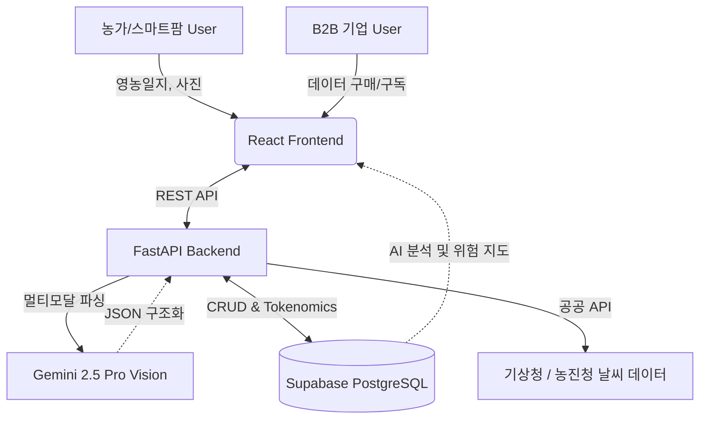

# MDGA (Universal Data Engine) - 특허 상담 및 선행기술조사 요청 자료

본 문서는 변리사님과의 비대면/화상 미팅 시 빠른 이해를 돕고, 핵심 비즈니스 모델(BM) 및 기술 특허 출원 가능성을 타진하기 위해 요약된 자료입니다.

---

## 1. 프로젝트 개요 (Overview)

*   **서비스명:** MDGA (Universal Data Engine)
*   **분야:** 농업 AX (Agricultural AI Transformation), B2B 데이터 마켓플레이스, 스마트팜/축산
*   **핵심 문제 (Pain Point):** 
    1. 농가의 영농일지가 여전히 수기로 작성되어 데이터가 유실 및 파편화됨.
    2. 자율주행 농기계, AI 비전 기업 등은 학습에 사용할 '실제 농업 환경의 정형 데이터'가 절대적으로 부족함.
*   **해결책 (Solution):** 농민의 수기 일지 및 현장 사진을 멀티모달 AI가 즉시 정형 데이터(HACCP 표준 등)로 구조화하고, 이를 바탕으로 기후 변화 시뮬레이션을 돌려 고품질의 합성 데이터(Synthetic Data)를 생성, B2B 기업에 판매하는 파이프라인 거래소 구축.

---

## 2. 시스템 아키텍처 (System Architecture)

*   **프론트엔드:** React, Vite, Leaflet (지도 시각화)
*   **백엔드:** Python FastAPI, SQLAlchemy (3NF 정규화 DB)
*   **데이터 레이크:** Google Drive API (OAuth 2.0 최소 권한 제어)
*   **AI 모델:** Google Gemini 2.5 Pro (Intent Parsing 및 멀티모달 비전)

---

## 3. 핵심 특허 청구 대상 후보 (Key Patentable Features)

아래 4가지 핵심 로직에 대해 BM 특허 또는 기술 특허 출원 가능성을 검토하고자 합니다.

### 💡 (후보 1) 멀티모달 AI를 활용한 비정형 영농일지의 이종 산업 맞춤형 정형화 시스템
*   **설명:** 사용자가 자연어 음성("오늘 온도 30도")과 수기 장부 사진을 업로드하면, AI가 사용자의 산업군(양돈 vs 스마트팜)을 자동으로 식별하여 각각 다른 JSON 스키마(예: 양돈은 백신 종류, 스마트팜은 생육 단계)로 강제 파싱하여 관계형 DB에 적재하는 파이프라인.

### 💡 (후보 2) 공간 계층 롤업(Roll-up) 및 기후 시뮬레이션 기반 농업 합성 데이터 생성 방법
*   **설명:** 개별 농가 데이터의 프라이버시 보호를 위해, 데이터를 '동 -> 구 -> 시' 단위로 계층적 롤업(Roll-up) 연산을 수행함. 이 롤업된 데이터에 외부 기상청 데이터와 자체 '기후 스트레스 계수(Climate Stress Factor)' 수식을 결합하여, AI 기업에 판매 가능한 '미래 작황 예측 합성 데이터'를 동적으로 생성하는 엔진 기술.

### 💡 (후보 3) 자연어 의도 분석기(Intent Parser) 분리를 통한 데이터베이스 안전 제어 아키텍처
*   **설명:** 일반적인 챗봇의 'Safety Alignment(권한 거부)' 문제를 해결하기 위해, 사용자의 자연어 명령("내 농장 데이터 지워줘")을 대화용 AI가 아닌 '시스템 제어용 의도 분석기'로 넘겨 `{"action": "DELETE", "target": "farm"}` 형태의 명령어로만 치환하게 만듦. 백엔드는 이 JSON을 파싱하여 DB 트랜잭션을 실행하는 안전한 AI-to-DB 제어 시스템.

### 💡 (후보 4) 멀티모달 비전 AI 기반 B급 농산물 자동 등급 판별 및 이종 산업 매칭 플랫폼
*   **설명:** 농가가 버려지는 B급(못난이) 농산물 사진을 올리면, AI 비전 모델이 외관을 스캔하여 등급(A/B/C)을 자동 판별함. 동시에 당도나 상태를 추론하여 "지역 베이커리의 잼 가공용" 등으로 최적의 이종 산업 사용처를 추천하고, 해당 소상공인과 즉시 직거래를 연결해 주는 플랫폼 비즈니스 모델(BM).

---

## 4. 변리사님께 드리는 질문 (Q&A)

1.  위 4가지 후보 중 **비즈니스 모델(BM) 특허로 가장 등록 가능성이 높은 것**은 무엇입니까?
2.  단순히 'AI를 사용했다'는 것만으로는 특허가 어렵다고 알고 있습니다. 위 시스템 아키텍처에서 **진보성을 인정받기 위해 청구항에 더 강조해야 할 기술적 특징(데이터 처리 순서 등)**이 있다면 무엇입니까?
3.  현재 프로토타입 개발이 완료되어 배포된 상태입니다. 이 단계에서 가출원 등을 진행할 때의 비용과 절차가 궁금합니다.
