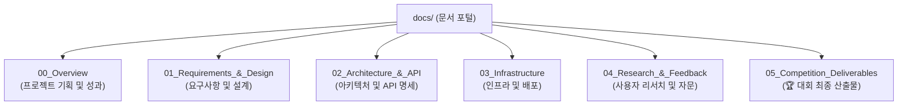

# MDGA (Universal Data Engine) - 2026 리빙랩 대회 아카이브 및 문서 포털 📂

본 문서는 **2026년 대구 지역전략산업 문제해결 지식재산 리빙랩** 대회를 성공적으로 마무리하고, 프로젝트의 모든 개발 명세 및 최종 산출물을 체계적으로 관리하기 위한 **통합 문서 인덱스 및 아카이브 포털**입니다.

대회는 공식적으로 종료되었으며, 본 저장소는 멘토링 피드백과 농업 AX(Agricultural AX) 피봇팅을 완벽히 반영한 최종 Production-Ready MVP 코드베이스와 문서를 영구 보존합니다.

---

## 🏆 대구 지식재산 리빙랩 2026 개요
* **프로젝트명**: MDGA (Universal Data Engine)
* **핵심 비전**: 파편화된 농가 데이터(수기 일지, 생육 이미지, 센서 로그)를 고부가가치의 지능형 합성 데이터로 전환 및 B2B 거래 지원
* **주요 성과**:
  1. **AI 데이터 원터치 변환기**: 수기 일지 및 방역 문서의 HACCP 표준 JSON 자동 구조화 (Gemini 2.5 Pro Vision 연동)
  2. **Twin Map 위험 모니터링**: 농장 주변 전염병(ASF 등) 및 기후 경계를 디지털 트윈 지도로 시각화 (Leaflet 연동)
  3. **B급 농산물 B2B 직거래**: 못난이 농작물 가공용 매칭 및 토크노믹스(지갑 모델) 구현
  4. **합성 데이터 엔진**: AgiBot, EnvHub, RoboCasa 연동을 통한 비전/자율주행용 합성 데이터 시뮬레이션 및 마켓 플레이스 제공

---

## 📂 리액터링된 문서 관리 구조 (Directory Index)

문서들은 용도와 대회 단계에 따라 **6개의 핵심 카테고리**로 체계화되었습니다. 아래 링크를 통해 각 문서에 바로 접근하실 수 있습니다.

### 🎯 1. Overview (프로젝트 및 성과 요약)
* **[프로젝트 상세 기획안 (PROJECT_SPEC_AND_PLAN.md)](./00_Overview/PROJECT_SPEC_AND_PLAN.md)**: MDGA의 비전, 핵심 기능 사양(Data Converter, Twin Map 등) 및 개발 마일스톤의 Single Source of Truth.
* **[포트폴리오 및 면접 활용 가이드 (PORTFOLIO_GUIDE.md)](./00_Overview/PORTFOLIO_GUIDE.md)**: 백엔드/프론트엔드/AI 직무별 핵심 문제 해결 경험(3NF 정규화, LLM 의도 파싱, OAuth 스코프 우회 등) 기술 면접 가이드.

### 📋 2. Requirements & Design (기획 및 유저 플로우)
* **[핵심 서비스 로직 및 피봇 계획 (service_logic/CORE_LOGIC_AND_PLANNING.md)](./01_Requirements_&_Design/service_logic/CORE_LOGIC_AND_PLANNING.md)**: 농업 AX 피봇팅 배경과 양돈 농가 및 스마트팜 타겟 페르소나 정의서.
* **[경쟁사 및 차별화 분석 (service_logic/COMPETITOR_ANALYSIS.md)](./01_Requirements_&_Design/service_logic/COMPETITOR_ANALYSIS.md)**: 팜모닝 등 기존 플랫폼 분석 및 MDGA만의 B2B 차별화 비즈니스 모델(BM) 분석.
* **[핵심 비즈니스 룰 및 제약사항 (requirements/BUSINESS_RULES.md)](./01_Requirements_&_Design/requirements/BUSINESS_RULES.md)**: AI 파싱 로직, THI 기후 스트레스 지수 공식 및 합성 시뮬레이션 알고리즘 정의.
* **[사용자 시나리오 및 Flow (design/USER_FLOW.md)](./01_Requirements_&_Design/design/USER_FLOW.md)**: Livestock(양돈) 및 Crop(스마트팜) 농가의 모바일 앱 연동 상세 흐름도.

### 🏛️ 3. Architecture & API (기술 설계 및 연동 규격)
* **[시스템 아키텍처 정의서 (architecture/SYSTEM_ARCH.md)](./02_Architecture_&_API/architecture/SYSTEM_ARCH.md)**: React frontend, FastAPI backend, Supabase DB, Google Drive 스토리지 간의 데이터 흐름 및 시퀀스 다이어그램.
* **[데이터베이스 스키마 정의서 (architecture/DB_SCHEMA.md)](./02_Architecture_&_API/architecture/DB_SCHEMA.md)**: PostgreSQL(Supabase) 테이블 물리 모델 및 3정규화(3NF) 릴레이션 관계도.
* **[자체 REST API 명세서 (api/REST_API_DOCS.md)](./02_Architecture_&_API/api/REST_API_DOCS.md)**: 백엔드에서 제공하는 회원가입, 일지 변환, 마켓 플레이스 및 지갑 조회 API 규격.
* **[외부 연동 API 명세서 (api/EXTERNAL_API_DOCS.md)](./02_Architecture_&_API/api/EXTERNAL_API_DOCS.md)**: Google Gemini API, Google Drive API, 기상청 공공데이터 연동 상세 가이드.

### ⚙️ 4. Infrastructure & DevOps (인프라 및 보안)
* **[인프라 배포 현황 (infrastructure/CURRENT_STATE.md)](./03_Infrastructure/infrastructure/CURRENT_STATE.md)**: Render.com Starter 서버 환경 및 Cloudflare Pages, Supabase 라이브 인프라 현황.
* **[개발 환경 및 배포 가이드 (infrastructure/DEPLOYMENT_GUIDE.md)](./03_Infrastructure/infrastructure/DEPLOYMENT_GUIDE.md)**: 로컬 환경 변수 설정 및 CI/CD 액션 배포 프로세스 가이드.
* **[보안 및 컴플라이언스 가이드 (infrastructure/SECURITY_COMPLIANCE.md)](./03_Infrastructure/infrastructure/SECURITY_COMPLIANCE.md)**: OAuth 2.0 최소 권한 제어, Supabase Row-Level Security(RLS) 및 데이터 암호화 정책.
* **[기술적 확장 로드맵 (infrastructure/FUTURE_EXPANSION.md)](./03_Infrastructure/infrastructure/FUTURE_EXPANSION.md)**: Redis 캐싱, PostGIS 공간 쿼리 및 대규모 Celery 태스크 큐 도입 계획.

### ⚖️ 5. Research & Feedback (사용자 리서치 및 전문가 자문 자료)
* **[돈사 영농인 김세찬 인터뷰 (interview/김세찬1.txt)](./04_Research_&_Feedback/interview/김세찬1.txt)**: 현장의 수기 일지 번거로움과 축사 전염병 방역 관리 애로사항 청취록.
* **[스마트팜 운영자 유재혁 인터뷰 (interview/유재혁1.txt)](./04_Research_&_Feedback/interview/유재혁1.txt)**: 매출 연동 재배량 추천 및 흠집 농산물 B2B 판매 처리에 대한 요구사항 청취록.
* **[지식재산(IP) 특허 자문 회의록 (ip_consultation/MEETING_MINUTES.md)](./04_Research_&_Feedback/ip_consultation/MEETING_MINUTES.md)**: 변리사 연계 특허성 분석 및 '합성 데이터 파이프라인' 기술 보호 전략 수립 회의록.

---

## 🏆 6. Competition Deliverables (대회 단계별 핵심 산출물 아카이브)

> [!NOTE]  
> HWP, PDF, PPTX, MP4와 같은 대용량 바이너리 파일들은 깃 저장소의 용량 최적화를 위해 `.gitignore` 처리되어 원격 깃허브에는 업로드되지 않지만, **본 로컬 워크스페이스 상에는 안전하게 보관**되어 있습니다. 로컬에서 원본 파일로 즉시 열어보실 수 있습니다.

### 📁 0) 제안 및 신청 단계 (docs/05_Competition_Deliverables/00_Proposal/)
대회 참여를 위한 초기 제안 및 서류 제출 단계의 자료입니다.
* **참가신청서 및 제안서**: **[[MDGA_리빙랩_제안] 참가신청서_및_제안서_이상재.pdf](./05_Competition_Deliverables/00_Proposal/[MDGA_리빙랩_제안] 참가신청서_및_제안서_이상재.pdf)**

### 📁 1) 중간 점검 단계 (docs/05_Competition_Deliverables/01_Intermediate/)
중간 심사 당시 제출 및 발표했던 핵심 자료입니다. 모든 파일은 직관적으로 명명되었습니다.
* **중간 발표 슬라이드**: **[[MDGA_리빙랩_중간] 발표자료.pptx](./05_Competition_Deliverables/01_Intermediate/[MDGA_리빙랩_중간] 발표자료.pptx)**
* **중간 시연 동영상**: **[[MDGA_리빙랩_중간] 시연영상.mp4](./05_Competition_Deliverables/01_Intermediate/[MDGA_리빙랩_중간] 시연영상.mp4)** (초기 MVP 실행 화면)
* **중간 공식 회의록 및 보고서**: **[[MDGA_리빙랩_중간] 활동보고서_및_회의록.pdf](./05_Competition_Deliverables/01_Intermediate/[MDGA_리빙랩_중간] 활동보고서_및_회의록.pdf)**

### 📁 2) 최종 제출 단계 (docs/05_Competition_Deliverables/02_Final/)
대회 본선 및 최종 심사를 위해 제작된 마스터 피스들입니다.
* **최종 발표 슬라이드 (PPTX)**: **[[MDGA_리빙랩_최종] 발표자료.pptx](./05_Competition_Deliverables/02_Final/[MDGA_리빙랩_최종] 발표자료.pptx)**
* **최종 발표 보고서 (PDF)**: **[[MDGA_리빙랩_최종] 발표보고서.pdf](./05_Competition_Deliverables/02_Final/[MDGA_리빙랩_최종] 발표보고서.pdf)**
* **최종 시연 동영상**: **[[MDGA_리빙랩_최종] 시연영상.mp4](./05_Competition_Deliverables/02_Final/[MDGA_리빙랩_최종] 시연영상.mp4)** (AI 파이프라인 완벽 연동 데모)
* **최종 데모 영상 기획 및 스크립트**: **[[MDGA_리빙랩_최종] 시연영상_제작스크립트.md](./05_Competition_Deliverables/02_Final/[MDGA_리빙랩_최종] 시연영상_제작스크립트.md)**
* **최종 공식 회의록 및 최종 결과 보고서**: **[[MDGA_리빙랩_최종] 활동보고서_및_회의록.pdf](./05_Competition_Deliverables/02_Final/[MDGA_리빙랩_최종] 활동보고서_및_회의록.pdf)**

### 📁 3) 홍보 및 카드뉴스 (docs/05_Competition_Deliverables/03_CardNews/)
리빙랩 성과 홍보를 위해 제작된 카드뉴스 원본 이미지 및 본문 텍스트입니다.
* **카드뉴스 설명 본문**: **[[MDGA_리빙랩_카드뉴스] 카드뉴스_설명글.txt](./05_Competition_Deliverables/03_CardNews/[MDGA_리빙랩_카드뉴스] 카드뉴스_설명글.txt)**
* **디자인 슬라이드 이미지**:
  - **[[MDGA_리빙랩_카드뉴스] 01_메인표지.jpeg](./05_Competition_Deliverables/03_CardNews/[MDGA_리빙랩_카드뉴스] 01_메인표지.jpeg)**
  - **[[MDGA_리빙랩_카드뉴스] 02_기능소개.png](./05_Competition_Deliverables/03_CardNews/[MDGA_리빙랩_카드뉴스] 02_기능소개.png)**
  - **[[MDGA_리빙랩_카드뉴스] 03_비즈니스모델.png](./05_Competition_Deliverables/03_CardNews/[MDGA_리빙랩_카드뉴스] 03_비즈니스모델.png)**

### 📁 4) 교육 및 안내 자료 (docs/05_Competition_Deliverables/04_References/)
대회 주최 측에서 제공한 핵심 사전 교육 자료 및 중간점검 가이드라인입니다.
* **사전 교육 자료**: **[[MDGA_리빙랩_교육] 사전_교육자료.pdf](./05_Competition_Deliverables/04_References/[MDGA_리빙랩_교육] 사전_교육자료.pdf)**
* **중간점검 교육 자료**: **[[MDGA_리빙랩_교육] 중간점검_교육자료_김보라.pdf](./05_Competition_Deliverables/04_References/[MDGA_리빙랩_교육] 중간점검_교육자료_김보라.pdf)**

---

## 💡 정리가 완료된 후 다음 단계 안내
1. **로컬 파일 확인**: 이 정리는 로컬에 저장되어 있는 최종 결과물(.pptx, .mp4, .pdf 등)들의 이름과 대화 기록을 손상시키지 않고 논리적으로 완전히 직관적인 한글 파일명으로 통일했습니다.
2. **2차 정리 협업**: 이제 사용자분께서 문서를 훑어보신 후 최종적인 보완 및 커스텀 조정을 하실 수 있는 완벽한 뼈대가 마련되었습니다. 언제든 추가 지시사항을 말씀해 주세요!
