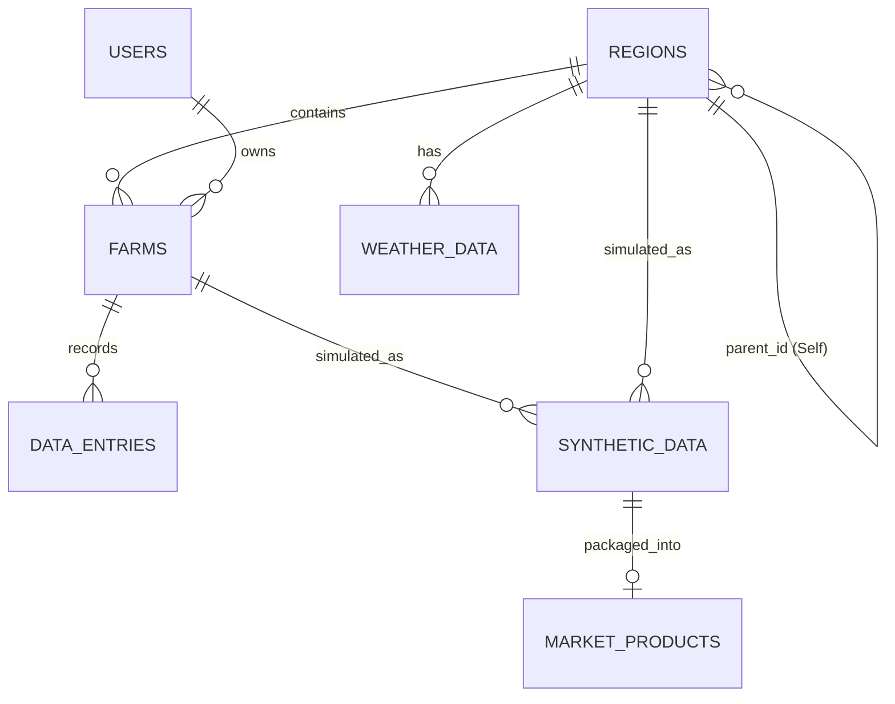

# MDGA (Universal Data Engine) - 데이터베이스 스키마 설계 (DB Schema) v2.0

본 문서는 MDGA 프로젝트의 핵심 엔티티, 상세 테이블 컬럼, 제약조건, 인덱싱 전략 및 관계(ERD)를 정의합니다.

## 1. Entity-Relationship Diagram (ERD)

## 2. 테이블 상세 명세 (Table Specifications)

모든 테이블은 기본적으로 `id` (UUID 타입, Primary Key), `created_at` (Timestamp, 생성일시), `updated_at` (Timestamp, 수정일시) 컬럼을 갖습니다.

### 2.1 `users` (사용자 계정)
농민(데이터 공급자) 및 B2B 클라이언트(데이터 수요자) 계정 관리.
*   `id` (UUID, PK)
*   `email` (String, Unique, Index)
*   `hashed_password` (String)
*   `role` (Enum: `FARMER`, `B2B_CLIENT`, `ADMIN`) - 역할 기반 권한 제어(RBAC) 용도
*   `is_active` (Boolean, Default: True)

### 2.2 `regions` (행정구역/공간 계층)
대한민국 행정구역(광역지자체 -> 기초지자체 -> 읍면동) 트리 구조 지원용 테이블.
*   `id` (UUID, PK)
*   `name` (String, Index) - 예: "경상남도", "진주시"
*   `level` (Enum: `PROVINCE`, `CITY`, `TOWN`)
*   `parent_id` (UUID, FK -> `regions.id`, Nullable, Index) - 루트 계층(도/광역시)은 Null.
*   `polygon_data` (JSONB) - 지도 렌더링용 GeoJSON Feature 좌표.
*   **Index:** `idx_region_parent` (`parent_id`) 계층 쿼리 속도 최적화.

### 2.3 `farms` (농가/마스터 데이터)
사용자(농민)가 소유한 개별 농장의 기본 메타데이터.
*   `id` (UUID, PK)
*   `user_id` (UUID, FK -> `users.id`, Index)
*   `region_id` (UUID, FK -> `regions.id`, Index)
*   `name` (String) - 농장 이름
*   `crop_type` (String) - 재배 작물명 (예: 딸기, 토마토)
*   `area_size` (Float) - 재배 면적 (제곱미터)
*   `latitude` (Float) - 위도
*   `longitude` (Float) - 경도
*   **Constraint:** 한 유저는 여러 농장을 가질 수 있으나(`1:N`), 농장의 위치는 반드시 특정 Region에 종속됨.

### 2.4 `data_entries` (관측 데이터 / 영농일지 Raw Data)
매일 기록되는 영농 일지, 센서 로그, AI 파싱 결과가 저장되는 시계열 테이블.
*   `id` (UUID, PK)
*   `farm_id` (UUID, FK -> `farms.id`, Index)
*   `record_date` (Date, Index) - 관측 날짜
*   `temperature` (Float, Nullable) - 내부/외부 온도
*   `humidity` (Float, Nullable) - 습도
*   `growth_stage` (String, Nullable) - 생육 단계 (예: 파종, 개화, 수확)
*   `pest_disease` (Boolean, Default: False) - 병해충 관측 여부
*   `raw_text` (Text, Nullable) - 사용자가 입력한 자연어 일지 원문
*   `image_url` (String, Nullable) - 업로드된 이미지 스토리지 링크
*   `parsed_by_ai` (Boolean, Default: False) - Gemini를 통한 자동 추출 데이터 여부
*   **Index:** 시계열 데이터 조회를 위한 복합 인덱스 `idx_farm_date` (`farm_id`, `record_date DESC`).

### 2.5 `weather_data` (기상청 공공 데이터)
기상청 API로부터 수집하는 지역별 날씨 정보.
*   `id` (UUID, PK)
*   `region_id` (UUID, FK -> `regions.id`, Index)
*   `record_date` (Date, Index)
*   `avg_temp` (Float)
*   `max_temp` (Float)
*   `min_temp` (Float)
*   `precipitation` (Float) - 강수량(mm)

### 2.6 `synthetic_data` (시뮬레이션/합성 데이터)
시뮬레이터를 통해 생성된 미래 예측치. Farm 단위 또는 Region 단위로 생성될 수 있습니다.
*   `id` (UUID, PK)
*   `source_farm_id` (UUID, FK -> `farms.id`, Nullable) - 기준이 된 특정 농장
*   `source_region_id` (UUID, FK -> `regions.id`, Nullable) - 롤업된 기준 지역
*   `target_date` (Date) - 예측 대상 시점
*   `scenario_type` (Enum: `NORMAL`, `EXTREME_HEAT`, `HEAVY_RAIN`, `COLD_WAVE`) - 기후 시나리오
*   `simulated_yield` (Float) - 예측 수확량
*   `thi_index` (Float) - 예측 열 스트레스 지수 (THI)
*   **Constraint:** `source_farm_id` 와 `source_region_id` 둘 중 하나는 반드시 존재해야 함 (Check Constraint).

### 2.7 `market_products` (B2B 데이터 상품 패키지)
합성 데이터를 패키징하여 거래소에 올리는 정보.
*   `id` (UUID, PK)
*   `synthetic_data_id` (UUID, FK -> `synthetic_data.id`, Unique) - 1:1 매핑
*   `title` (String) - 상품명 (예: "2026 경남지역 폭염 시나리오 작황 데이터")
*   `description` (Text) - 상세 설명
*   `price` (Integer) - 가격 (원)
*   `is_active` (Boolean, Default: True) - 판매 상태

## 3. 주요 제약조건 및 연계 삭제 (Cascading Deletes)
*   `users` 삭제 시 -> 해당 유저의 `farms` 연쇄 삭제 (`ON DELETE CASCADE`).
*   `farms` 삭제 시 -> 해당 농장의 `data_entries` 연쇄 삭제 (`ON DELETE CASCADE`).
*   `regions` 삭제 로직은 시스템 안정성을 위해 가급적 **소프트 삭제(Soft Delete)** 하거나 `RESTRICT`를 걸어 하위 농장이 있을 경우 삭제를 막습니다.
